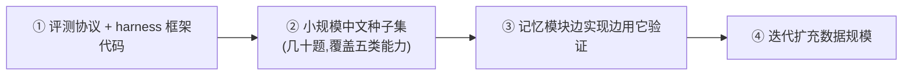

# Benchmark 子项目

Benchmark 是与记忆模块**并列的一等子项目**,不是记忆模块的附属测试。它的存在是为了让"高精确率、低噪音"这个目标**可被验证**——没有裁判,所有设计取舍(去重阈值、融合权重、是否 rerank、衰减曲线)都只能拍脑袋。

> **为什么把 benchmark 提到一等地位?** 调研发现行业里多个记忆系统的评测翻过车:Mem0 宣称 LongMemEval 93.4%,第三方用干净 harness 跑出 73.8%;LoCoMo 被审计出 6.4% 的标准答案是错的、LLM 判官接受多达 63% 的故意错误答案。**评测如果是事后补的、掺水的,整个"高精确率"主张就站不住。** 所以我们让裁判先于(或并行于)选手就位。

## 目标与定位

- **场景**:Kairos 记忆模块的主要使用场景以**中文**为主,现有公开基准(LongMemEval/LoCoMo)绝大多数是英文,不够用。因此**自建高质量中文多会话数据集 + 完整评测协议**(决策见下)。
- **核心指标导向**:衡量**精确率(precision)而非召回率**,并把 **abstention(无相关记忆时拒答而非编造)** 和 **distractor 鲁棒性(注入无关记忆后精确率是否崩)** 作为一等评测维度——这三者直接对应"低噪音"目标。
- **可归因**:把**写入(抽取)质量**与**检索质量**分开评测,失败能定位到是"没抽对"还是"抽对了没检索到"。

## 推进策略(已决策)

**先协议 + 框架 + 小规模种子集打通端到端,后迭代扩充数据规模。**

> **为什么不一上来做大数据集?** 高质量数据集工作量极大(LongMemEval 500 题 + 大量人工重写)。先做协议 + 种子集能立刻让记忆模块的设计取舍可验证、不拖主线;数据规模随迭代扩充。裁判先到场,哪怕一开始只能裁几十个回合。

## 数据集构造(已决策)

**LLM 生成多会话对话 + 人工校验/重写关键题目**(LongMemEval/LoCoMo 的主流做法,质量与成本平衡)。详见 [dataset](./dataset.md)。

> 需要业务输入:数据集要面向什么类型的 Agent / 用户画像(场景本体)。这是构造前的开放项,见 [dataset](./dataset.md) §场景本体。

## 文档导航

| 文档 | 内容 |
|------|------|
| [protocol](./protocol.md) | 评测协议:能力分类、指标定义(Precision@K/abstention/distractor)、写入与检索分离评测、LLM-judge 防坑 |
| [dataset](./dataset.md) | 中文数据集构造规范:场景本体、LLM 生成 + 人工校验流程、证据标注、haystack 构造 |

## 与记忆模块的关系

- benchmark **不依赖**记忆模块的内部实现,只通过记忆模块的对外接口(见 [memory/api](../memory/api.md))喂入记忆、发起检索、收集结果。这样它能作为中立裁判,也能在未来评测其他记忆实现。
- 代码落位规划见 [project/roadmap](../../project/roadmap.md);本阶段先产出协议与数据规范文档。

---

← 返回 [文档导航](../../README.md)
