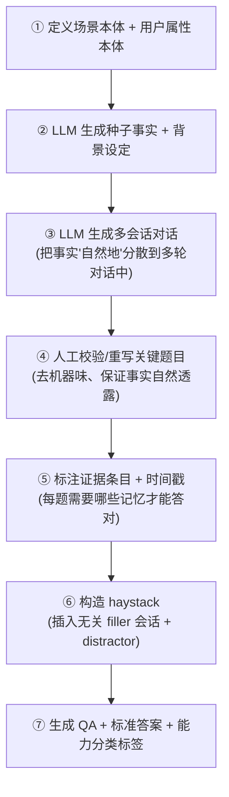

# 中文数据集构造规范

本文定义 Kairos 自建中文多会话记忆数据集的构造方法。**方式已决策:LLM 生成 + 人工校验/重写**(LongMemEval/LoCoMo 的主流做法,质量与成本平衡)。

## 为什么自建中文数据集

现有公开记忆基准(LongMemEval、LoCoMo、MSC、PrefEval、MemoryAgentBench)**绝大多数是英文**;中文专用的(如 Mem-PAL/PAL-Bench)极少且面向特定场景。Kairos 记忆模块的主要使用场景以中文为主,英文基准无法真实反映中文分词、指代、表达习惯下的检索质量。因此自建。

## 场景本体(开放项,需业务输入)

数据集的真实度取决于"对话围绕什么场景展开"。构造前需先定义**场景本体**:

- **面向什么类型的 Agent / 用户**?(如:个人助理、客服、编程助手、生活陪伴……)
- **用户会透露哪些类型的事实/偏好**?需要一个属性本体(借鉴 LongMemEval 的 164 个用户属性)——如个人基本信息、长期偏好、阶段性目标、关系网络、时间相关事件等。
- 这直接决定个人记忆"该记什么"(与 [memory/memory-types](../memory/memory-types.md) 的 personal 记忆呼应)。

> 这是构造数据前的**第一个待办**,需要和业务方对齐。在此之前 dataset 的具体题目无法定稿。种子集可先用一个通用"个人助理"场景起步。

## 构造流程(LLM 生成 + 人工校验)



**逐步说明:**

**① 本体定义。** 见上文场景本体。产出用户属性清单与场景设定。

**② 种子事实生成。** LLM 按本体生成一批"用户事实"(facts/preferences/profile),作为对话要透露的 ground-truth。

**③ 多会话对话生成。** LLM 生成跨多会话的对话,把种子事实**间接、自然地**分散透露(借鉴 LongMemEval:要表达"买了新车",先聊车险再顺带提及,而非直白陈述)。每个会话带合理时间戳。

**④ 人工校验/重写。** 关键题目人工过一遍:去除机器生成的雷同感、确保事实透露方式自然、修正逻辑错误。**这是质量的关键环节**——LoCoMo 翻车正因为缺这步(6.4% 答案键错误)。

**⑤ 证据标注。** 每道题标注:回答它需要哪些记忆条目(证据)、各证据所在会话与时间戳。**这是算 Precision@K/Recall@K 的前提**,也是写入/检索分离评测里 "Oracle Evidence" 的来源。

**⑥ haystack 构造。** 把证据会话插入大量无关 filler 会话中(needle-in-haystack),并按 [protocol](./protocol.md) 注入三类 distractor(ID/OOD/hard-negative)。提供不同规模变体(如小规模 oracle、中等规模)。

**⑦ QA 生成。** 为每道题生成问题 + 标准答案 + 能力分类标签(IE/MR/KU/TR/ABS)。其中:
- **KU 题**:让某事实在对话中发生变化,问最新值。
- **TR 题**:问涉及时间的推理。
- **ABS 题**:构造**虚假前提**问题(历史中不存在的信息),标准答案是"拒答"。

## 五类能力的题目配比(种子集)

种子集(几十题)应覆盖全部五类,初步配比建议(可调):

| 能力 | 占比 | 备注 |
|------|------|------|
| 信息抽取 IE | ~30% | 基本功,量最大 |
| 多会话推理 MR | ~20% | |
| 知识更新 KU | ~20% | 重点观测(ADR 0004) |
| 时序推理 TR | ~15% | 重点观测(ADR 0004) |
| 拒答 ABS | ~15% | 一等维度 |

## 数据格式(草案)

每道题一条记录,字段草案:

```jsonc
{
  "id": "kb-001",
  "capability": "knowledge-update",        // IE | MR | KU | TR | ABS
  "sessions": [                             // 多会话历史(haystack)
    {
      "session_id": "s1",
      "timestamp": "2026-01-05T10:00:00",
      "turns": [ {"role": "user", "text": "..."}, {"role": "assistant", "text": "..."} ]
    }
  ],
  "evidence": [                             // 证据标注(算 Precision/Recall 用)
    {"session_id": "s3", "turn_index": 2, "timestamp": "..."}
  ],
  "distractors": [                          // 注入的干扰项(可选)
    {"type": "hard_negative", "session_id": "s5", "turn_index": 1}
  ],
  "question": "用户现在用的是什么手机?",
  "answer": "...",                          // 标准答案;ABS 题为约定的"拒答"标记
  "is_abstention": false
}
```

> 格式随 harness 实现细化;此处为设计草案,字段以最终 harness 为准。

## 质量底线

- **每道题的证据标注必须人工确认**——错误的标注会让所有检索指标失真(LoCoMo 的教训)。
- **ABS 题的虚假前提要真的"无法从历史推出"**,不能是变相的难题。
- **distractor 要真的无关**(尤其 hard-negative 要语义相近但事实不匹配),否则测不出抗噪音。
- 数据集本身纳入版本管理,变更可追溯。

---

← 返回 [benchmark](./README.md)
