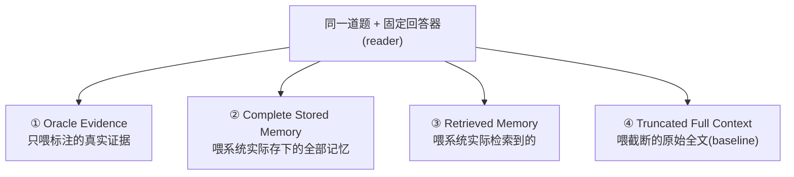

# 评测协议

本文定义 Kairos 记忆模块的评测协议:测什么能力、用什么指标、如何把写入与检索分开归因、如何避免 LLM-judge 的坑。协议设计的依据来自对现有记忆基准(LongMemEval、LoCoMo、MINTEval、Mem0/Zep 评测)的调研。

## 设计原则:为"高精确率、低噪音"量身

普通 RAG 评测重 recall(别漏)。我们的目标相反——**重 precision(别脏)**,并显式测"该不该返回"。三条原则贯穿:

1. **精确率优先于召回率**:主指标是 Precision@K,Recall@K 作副指标(保证不过度激进地什么都不返回)。
2. **拒答是能力,不是失败**:无相关记忆时拒答(abstention)正确率是一等指标。会编造的系统精确率再高也是假的。
3. **抗噪音是硬要求**:注入无关记忆(distractor)后,精确率的下降幅度要被量化。

## 能力分类(五类)

借鉴 LongMemEval 的能力划分,适配中文场景:

| 能力 | 缩写 | 测什么 | 为什么重要 |
|------|------|--------|-----------|
| **信息抽取** | IE | 从冗长历史中召回某条具体事实/偏好 | 记忆的基本功 |
| **多会话推理** | MR | 跨多个会话综合信息(聚合/比较) | 检验记忆是否真被"用起来" |
| **知识更新** | KU | 识别用户信息变化并用最新值回答 | 对应 ADR 0004 的"冲突管删除"——验证扁平方案处理事实变更的能力 |
| **时序推理** | TR | 对时间的感知(显式时间 + 时间戳) | 这是不做图后最该盯的能力(图唯一强项),用它判断扁平方案是否够 |
| **拒答** | ABS | 历史中不存在的信息,应拒答而非编造 | "低噪音"在端到端层的直接体现 |

> KU 和 TR 是**重点观测项**:ADR 0004 决定不做知识图谱,而图唯一不可替代的强项正是这两类。benchmark 必须能客观回答"扁平方案在 KU/TR 上够不够"——若数据证明不足,才是重新考虑上图的依据。

## 指标定义

### 检索层指标(组件级)

前提:数据集对每道题标注了**证据条目**(哪些记忆是回答所需的 ground-truth),才能算这些指标。

| 指标 | 定义 | 用途 |
|------|------|------|
| **Precision@K** | top-K 命中中真正相关的比例 | **低噪音主指标**——直接惩罚返回的无关项 |
| **Recall@K** | 全部相关项中被 top-K 召回的比例 | 副指标,防止系统为了 precision 过度保守 |
| **MRR** | 第一个相关结果排名的倒数的平均 | 单答案场景 |
| **nDCG@K** | 带位置折扣 + 分级相关性,对理想排序归一化 | 多个分级相关记忆的场景 |

### 端到端指标(任务级)

| 指标 | 定义 | 说明 |
|------|------|------|
| **任务准确率** | LLM-judge 判断最终回答是否正确 | 主指标;判官规则见下文防坑 |
| **Abstention 正确率** | 虚假前提题中,系统正确拒答的比例 | 一等指标 |
| **抗噪音衰减曲线** | 随 distractor 数量增加,precision/准确率的下降幅度 | 量化"低噪音" |

> **为什么端到端也要测,不只测检索?** 检索 precision 高,不代表 LLM 用对了;反之检索一般但回答对了也可能是模型脑补。两层都测才能定位问题。

## 写入与检索分离评测(可归因)

记忆系统有两个核心动作:**写入(把对话/trace 提炼成记忆)** 和 **检索**。失败可能出在任一环。借鉴"固定 reader + 四条件"诊断协议,把同一个回答器分别喂四种输入:

归因逻辑:

- **① vs ②**:差距 = **写入质量损失**(Δ_write)。证据本该被存下,但抽取阶段丢了或抽错了。
- **② vs ③**:差距 = **检索质量损失**(Δ_retr)。记忆存下了,但没检索到。
- **① 的上限**:回答器在完美证据下的天花板。
- **④**:不用记忆系统的对照(直接塞原文)。

这样一道题失败时,能明确归因到"没抽对"还是"抽对了没检索到",而不是笼统地"记忆系统不行"。这对调参极有价值。

> 此外可叠加独立的**抽取准确率**评测:给定一段对话,直接评 LLM 抽取出的事实是否正确/完整(对象级 + 字段级),不经过检索。

## Distractor 鲁棒性

借鉴 MINTEval/NoisyBench:系统性注入无关记忆,观察精确率与准确率随干扰项数量的下降。

- **干扰项类型**:① In-Domain(同领域但无关,如另一个用户的相似偏好)② Out-of-Domain(完全无关)③ Hard-negative(语义相近但实际不匹配,最难)。
- **输出**:一条"干扰项数量 → precision/准确率"的衰减曲线。曲线越平,抗噪音越强。
- 这是"低噪音"最直接的压力测试——NoisyBench 报告噪音下最高 80% 性能崩溃,是真实风险。

## LLM-as-judge 防坑

端到端准确率用 LLM-judge(因答案形式灵活,exact-match 不可靠)。但调研显示这是翻车重灾区,必须立规矩:

| 坑 | 我们的做法 |
|----|-----------|
| 判官 prompt 不公开、无法复现 | **判官 prompt 纳入仓库版本管理**,公开可审 |
| 单向判官(只允许 wrong→correct) | **双向判官**,既能纠错也能纠对为错 |
| 硬编码题目等价规则(掺水) | **禁止**任何按题目 ID 的特判;判官只看"回答 vs 标准答案" |
| 判官偏好流畅度而非正确性(LightRAG 反例:流畅但事实全错) | 判官 prompt 明确**以事实正确为准**,不被流畅措辞带偏;辅以 Precision/F1 类指标交叉验证 |
| 跨系统数字不可比 | 同一 harness、同一判官、同一数据跑所有被测系统 |

> LightRAG 的反例值得记住:它 Human-like 正确率 0.96(最高)但 F1 仅 0.09——读起来流畅自然、具体事实大多是错的。**只看一个指标会被骗**,所以端到端 LLM-judge 必须和检索层 precision 类指标一起看。

## 报告什么

每次评测产出一份结构化报告,至少包含:

- 五类能力各自的端到端准确率
- 检索层 Precision@K / Recall@K / nDCG@K
- Abstention 正确率
- Distractor 衰减曲线
- 写入/检索分离的 Δ_write 与 Δ_retr
- 本次的配置(embedding 模型、是否 rerank、融合权重、去重阈值等),保证可复现

---

下一篇:[dataset](./dataset.md) — 中文数据集构造规范。
