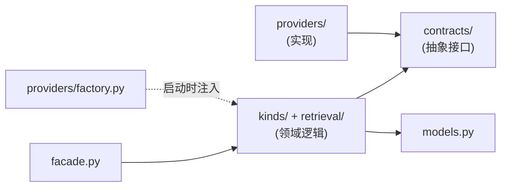

# 记忆模块 (Memory)

记忆模块是第一阶段唯一实现的 infra 模块。它**自包含**:领域逻辑、它依赖的存储/模型抽象、它的对外接口,全部收在本模块内(`src/kairos/modules/memory/`),只依赖底座,不依赖其他模块。

## 模块职责

管理三类记忆,每类有独立的写入触发、存储结构、检索方式、生命周期/淘汰策略;三类共享一套统一检索层和统一存储抽象(LanceDB)。

| 记忆类型 | 本质 | 文档 |
|---------|------|------|
| 长期个人记忆 `personal` | 跨会话、长期稳定的用户事实与偏好 | [memory-types](./memory-types.md) §个人 |
| 短期会话记忆 `session` | 单次会话内的上下文,有明确生命周期 | [memory-types](./memory-types.md) §会话 |
| 执行经验 `experience` | 从 Agent 执行 trace 提炼的可复用经验 | [memory-types](./memory-types.md) §经验 |

## 模块内部结构

```
modules/memory/
├── facade.py          # 对外唯一入口(适配层只碰它)
├── models.py          # 领域模型 + LanceDB schema(MemoryBase + 三类 kind)
├── contracts/         # 模块内的抽象接口(只服务本模块)
│   ├── vector_store.py    # VectorStore
│   ├── embedding.py       # EmbeddingProvider
│   ├── rerank.py          # RerankProvider
│   └── tokenizer.py       # Tokenizer
├── providers/         # 抽象的具体实现(可插拔)
│   ├── vector/lancedb_store.py
│   ├── embedding/{openai_compat,sentence_transformer}.py
│   ├── rerank/{cross_encoder,http_rerank}.py
│   ├── tokenizer/jieba_tokenizer.py
│   └── factory.py         # 配置驱动组装
├── kinds/             # 三类记忆各自的写入/淘汰逻辑
│   ├── personal.py
│   ├── session.py
│   └── experience.py
├── retrieval/         # 统一检索层
│   ├── searcher.py        # 检索编排 + 方法路由
│   ├── fusion.py          # RRF 等融合(纯计算,同步)
│   └── recall.py          # 向量/BM25 召回
└── experience/        # trace → 经验提炼
    ├── distiller.py
    └── trace_schema.py
```

## 模块内的依赖规则

模块内部遵循**领域 → 抽象 → 实现**的依赖倒置:



- **领域逻辑(`kinds/`、`retrieval/searcher`)只依赖 `contracts/` 抽象**,不依赖 `providers/`,不 `import lancedb`。
- 具体实现由 `providers/factory.py` 按配置组装,注入给领域逻辑(依赖倒置)。
- 这保证:换向量库 / 换模型 = 改 `providers/` + 一处 factory 登记,领域逻辑零改动。

## 为什么抽象接口在模块内,而不在底座

`VectorStore`/`EmbeddingProvider` 等抽象目前**只有记忆模块使用**。按项目的"避免过度设计"原则(见 [project/overview](../../project/overview.md)),它们就归记忆模块,不预先上提为全局契约。

这不牺牲任何可插拔性:模块的领域逻辑依赖模块内的抽象,实现配置注入,可替换性照常成立、契约测试照常保障。等阶段二出现上下文模块、且确实需要复用这些抽象时,再上提到底座——届时我们已经知道两个模块的真实需求,抽象不会猜错。

## 文档导航(模块内)

| 文档 | 内容 |
|------|------|
| [memory-types](./memory-types.md) | 三类记忆的数据模型(LanceDB schema)、写入/检索/淘汰路径;执行经验从 trace 提炼的流程设计 |
| [retrieval](./retrieval.md) | 统一检索层(向量/BM25/混合RRF/rerank 流程);embedding/rerank/向量库/tokenizer 可插拔抽象接口签名 |
| [api](./api.md) | 模块对外接口、适配层如何调用、DTO 与领域模型隔离、API 签名草案 |
| [tradeoffs](./tradeoffs.md) | 记忆相关技术取舍(LanceDB 边界、融合策略、本地vs远程模型)+ 依据来源汇总 |
| [everos-analysis](./everos-analysis.md) | 参考项目 EverOS 的记忆/检索设计分析:借鉴什么、不同取舍 |

---

← 返回 [文档导航](../../README.md)
