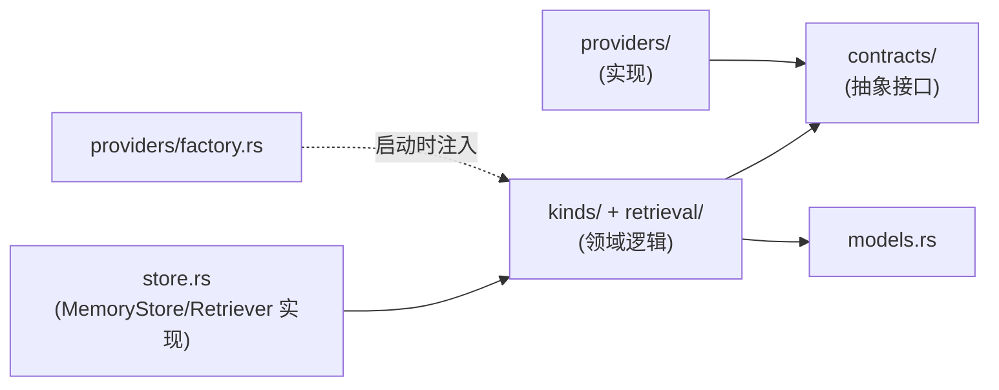

# 记忆模块 (Memory)

记忆模块是 L1 infra 模块之一(第一批实现)。它**自包含**:领域逻辑、它依赖的存储/模型抽象、它的对外契约,全部收在本模块内(`crates/memory/src/`),只依赖底座(`foundation`),不依赖其他模块。**唯一的跨模块编排发生在 harness 层**,harness 只 import 本模块的 `contracts/`,实现由组装根注入(六层架构,见 [architecture](../../project/architecture.md))。

## 模块职责

管理三类**长期记忆**,每类有独立的写入触发、存储结构、检索方式、生命周期/淘汰策略;三类共享一套统一检索层和统一存储抽象(LanceDB)。工作记忆(context 压缩)归 harness 层 Context Engine,不在本模块(ADR 0006)。

| 记忆类型 | 本质 | 文档 |
|---------|------|------|
| 语义记忆 `semantic` | 关于用户的去情境化事实与偏好("什么是真的") | [memory-types](./memory-types.md) §语义记忆 |
| 情景记忆 `episodic` | 发生过的对话/事件历史("发生过什么") | [memory-types](./memory-types.md) §情景记忆 |
| 程序记忆 `procedural` | 从 Agent 执行 trace 提炼的可复用策略("怎么做") | [memory-types](./memory-types.md) §程序记忆 |

## 模块内部结构

```
crates/memory/src/
├── contracts/         # 抽象接口(两类)
│   ├── store.rs           # 对外契约:MemoryStore / Retriever(harness 消费)
│   ├── vector_store.rs    # provider 契约:VectorStore
│   ├── embedding.rs       # provider 契约:EmbeddingProvider
│   ├── rerank.rs          # provider 契约:RerankProvider
│   └── tokenizer.rs       # provider 契约:Tokenizer
├── store.rs           # MemoryStore/Retriever 实现(领域逻辑总入口)
├── models.rs          # 领域模型(MemoryBase + 三类 kind)
├── providers/         # provider 契约的具体实现(可插拔)
│   ├── vector/lancedb_store.rs   # 含租户物理分表路由(ADR 0013)
│   ├── embedding/{openai_compat,sentence_transformer}.rs
│   ├── rerank/{cross_encoder,http_rerank}.rs
│   ├── tokenizer/jieba_tokenizer.rs
│   └── factory.rs         # 配置驱动组装
├── kinds/             # 三类记忆各自的写入/淘汰逻辑
│   ├── semantic.rs
│   ├── episodic.rs
│   └── procedural.rs
├── retrieval/         # 统一检索层
│   ├── searcher.rs        # 检索编排 + 方法路由
│   ├── fusion.rs          # RRF 等融合(纯计算,同步)
│   └── recall.rs          # 向量/BM25 召回 + RecallRouter(选择性召回门控)
// 注:trace 评估/提炼是模块外的独立关注点(ADR 0008),由 harness/distill 承担;
//    模块对 procedural 只暴露"写入已提炼经验"(write_experience)。
```

- **对外契约**(`contracts/store.rs`:`MemoryStore` / `Retriever`)是 harness 消费的稳定接口,签名首参 `ctx: &TenantContext`(ADR 0012)。
- **provider 契约**(`VectorStore` 等)是领域逻辑依赖、由 `providers/` 实现的内部抽象。

## 模块内的依赖规则

模块内部遵循**领域 → 抽象 → 实现**的依赖倒置:



- **领域逻辑(`store.rs`、`kinds/`、`retrieval/searcher`)只依赖 `contracts/` 抽象**,不依赖 `providers/`,不 `use lancedb`。
- 具体实现由 `providers/factory.rs` 按配置组装,注入给领域逻辑(依赖倒置)。
- 这保证:换向量库 / 换模型 = 改 `providers/` + 一处 factory 登记,领域逻辑零改动。

## 为什么抽象接口在模块内,而不在底座

`VectorStore`/`EmbeddingProvider` 等 provider 契约目前**只有记忆模块使用**。按项目的"避免过度设计"原则(见 [project/overview](../../project/overview.md)),它们就归记忆模块,不预先上提为全局契约。

这不牺牲任何可插拔性:模块的领域逻辑依赖模块内的抽象,实现配置注入,可替换性照常成立、契约测试照常保障。**Phase 3 出现第二个消费者(knowledge 模块)、且确实需要复用向量存储抽象时,再上提到底座**(ADR 0015)——届时我们已经知道两个模块的真实需求,抽象不会猜错。

## 文档导航(模块内)

| 文档 | 内容 |
|------|------|
| [memory-types](./memory-types.md) | 三类记忆的数据模型(LanceDB schema)、写入/检索/淘汰路径与时机;程序记忆的经验来源(评估/提炼在模块外,ADR 0008) |
| [retrieval](./retrieval.md) | 统一检索层(向量/BM25/混合RRF/rerank 流程)、选择性召回(RecallRouter + memory-as-a-tool);embedding/rerank/向量库/tokenizer 可插拔抽象接口签名 |
| [api](./api.md) | 模块对外契约(MemoryStore/Retriever)、harness 如何调用、ctx 首参与 DTO 零租户字段、双召回路径、配额责任 |
| [tradeoffs](./tradeoffs.md) | 记忆相关技术取舍(LanceDB 边界、融合策略、租户物理分表、本地vs远程模型)+ 依据来源汇总 |
| [everos-analysis](./everos-analysis.md) | 参考项目 EverOS 的记忆/检索设计分析:借鉴什么、不同取舍 |

## 关键决策与验证

本模块的核心设计取舍记录在 ADR,效果由 benchmark 验证:

- [ADR 0006](../../adr/0006-memory-classification-by-cognitive-function.md):记忆按认知功能分类(工作记忆归 harness 层,长期记忆分情景/语义/程序)。
- [ADR 0004](../../adr/0004-no-knowledge-graph-mvp.md):不做知识图谱,先做原子事实 + LLM 驱动 ADD/UPDATE/DELETE。
- [ADR 0005](../../adr/0005-decay-ranking-conflict-deletion.md):衰减管排序、冲突管删除,三类记忆分化。
- [ADR 0007](../../adr/0007-memory-mechanism-vs-policy-timing.md):记忆模块是机制,时机与质量评估是策略;写入分 kind、召回选择性(RecallRouter + memory-as-a-tool)。
- [ADR 0008](../../adr/0008-procedural-evaluation-decoupling.md):程序记忆的 trace 评估/提炼与记忆模块解耦,由 harness/distill 承担,模块只收已提炼经验。
- [ADR 0009](../../adr/0009-single-multi-user-scoping-isolation.md):单/多用户作用域与隔离;隔离是机制(强制 owner prefilter + fail-closed + 契约测试),共享是策略(留阶段二)。
- [ADR 0012](../../adr/0012-tenant-context-explicit-passing.md):TenantContext 显式传参,禁隐式全局态。
- [ADR 0013](../../adr/0013-lancedb-tenant-physical-tables.md):LanceDB 租户物理分表(`{tenant_id}__{kind}`),drop 表即合规删除。
- [ADR 0015](../../adr/0015-vector-store-uplift-foundation.md):向量存储契约与 RRF 融合在 Phase 3 上提 foundation。
- [benchmark 子项目](../benchmark/README.md):衡量"高精确率、低噪音",是上述取舍的裁判。

---

← 返回 [文档导航](../../README.md)
