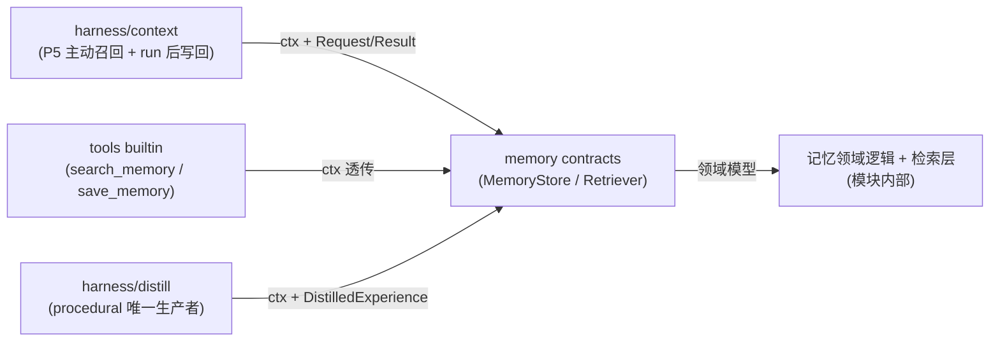

# 记忆模块对外接口

本文定义记忆模块对外暴露的契约与 DTO。核心约束(六层架构下):
**消费方是 harness 层**(Context Engine 的主动召回/写回、tools 的
`search_memory`/`save_memory`、distill 管线),经模块 `contracts/`
抽象消费,实现由组装根(composition root)注入;领域模型与存储
schema 永不外泄。

## 调用关系



三层对象,层层翻译:

| 对象 | 在哪层 | 谁能看见 | 作用 |
|------|--------|---------|------|
| **Request/Result DTO**(`contracts/`) | 模块对外 | harness | 稳定对外契约,serde 结构体,禁裸 map 跨层 |
| **领域模型**(`models.rs`) | 模块内部 | 仅记忆模块 | 领域逻辑 |
| **存储 schema**(providers 内) | provider 内部 | 仅 provider | LanceDB 表结构 |

> **为什么三层对象、显式翻译?** 它把"对外契约""领域逻辑""存储
> schema"三件事解耦:存储改字段不影响对外 API,对外 API 调整
> 不影响表结构,每层独立演进。代价是多写转换代码,用 serde
> 反序列化 / 简单 mapper 把成本压到最低。

## 租户上下文:ctx 首参(ADR 0012)

**所有读写/检索/淘汰接口签名首参 `ctx: TenantContext`。**
ctx 只能来自 server 认证中间件(TenantContext 的唯一构造点,
见 [architecture §3](../../project/architecture.md)),模块内不构造、
不信任任何调用方自报的租户标识。

**DTO 零租户字段**:`MemoryItem` 与所有 Request/Result 中
**不得出现** tenant_id / user_id 字段——隔离是调用上下文,
不是业务数据;字段存在本身就是越权构造的通道。

## 对外契约与 DTO

```rust
// crates/memory/src/contracts/(草案)
use std::collections::HashMap;
use serde::{Deserialize, Serialize};

/// 写入来源(写入矩阵三路径,支撑幂等去重与按来源回滚)。
#[derive(Debug, Clone, Copy, PartialEq, Eq, Serialize, Deserialize)]
#[serde(rename_all = "snake_case")]
pub enum MemorySource {
    RunExtract,     // Context Engine run 后异步抽取
    AgentExplicit,  // save_memory 工具(用户显式"记住")
    Distill,        // distill 管线(procedural 唯一来源)
}

#[derive(Debug, Clone, Copy, PartialEq, Eq, Serialize, Deserialize)]
#[serde(rename_all = "snake_case")]
pub enum MemoryKind {
    Semantic,
    Episodic,
    Procedural,
}

/// 对外的记忆条目表示,屏蔽内部 schema 细节。
/// id / kind / created_at 必带:Context Engine 的 id 级去重
/// 与"冲突时新者优先"依赖它们(见 harness/context.md §2.1)。
#[derive(Debug, Clone, Serialize, Deserialize)]
pub struct MemoryItem {
    pub id: String,
    pub kind: MemoryKind,
    pub text: String,
    pub created_at: f64,
    #[serde(default)]
    pub score: Option<f64>,                    // 仅检索返回时有
    #[serde(default)]
    pub metadata: HashMap<String, String>,     // scope(class/subject/term)等通用元数据
}

#[derive(Debug, Clone, Serialize, Deserialize)]
pub struct WriteRequest {
    pub kind: MemoryKind,
    pub text: String,
    pub source: MemorySource,
    #[serde(default)]
    pub source_run_ids: Vec<String>,           // 来源 run(幂等去重键的一部分)
    #[serde(default)]
    pub metadata: HashMap<String, String>,     // scope 推断结果等(context.md §5.1)
}

/// 一条**已提炼、已评估**的程序记忆经验。由 harness/distill
/// 管线产出(ADR 0008),记忆模块只负责去重/合并写入。
#[derive(Debug, Clone, Serialize, Deserialize)]
pub struct DistilledExperience {
    pub task_type: String,
    pub situation: String,                     // 适用情境描述(检索主要匹配它)
    pub action: String,                        // 策略内容
    pub outcome: String,
    pub success: bool,
    #[serde(default = "default_effectiveness")]
    pub effectiveness: f64,
    pub source_run_ids: Vec<String>,           // 来源 run 集合(查重合并时并集)
    #[serde(default)]
    pub metadata: HashMap<String, String>,
}

fn default_effectiveness() -> f64 {
    0.5
}

/// v1 只做**等值匹配**的最小过滤 DSL,如
/// {"class": "高二3班", "subject": "物理"};范围/复合查询暂缓。
/// 在召回阶段下推到存储层 prefilter(见 retrieval.md)。
#[derive(Debug, Clone, Default, Serialize, Deserialize)]
pub struct MetadataFilter {
    #[serde(default)]
    pub equals: HashMap<String, String>,
}

/// 检索方法。
#[derive(Debug, Clone, Copy, PartialEq, Eq, Serialize, Deserialize)]
#[serde(rename_all = "snake_case")]
pub enum RecallMethod {
    Vector,
    Keyword,
    Hybrid,
}

#[derive(Debug, Clone, Serialize, Deserialize)]
pub struct RecallRequest {
    pub query: String,
    #[serde(default = "default_kinds")]
    pub kinds: Vec<MemoryKind>,
    #[serde(default = "default_method")]
    pub method: RecallMethod,
    #[serde(default = "default_top_k")]
    pub top_k: u32,
    #[serde(default)]
    pub use_rerank: bool,
    #[serde(default)]
    pub filter: Option<MetadataFilter>,
}

fn default_kinds() -> Vec<MemoryKind> {
    vec![MemoryKind::Semantic]
}
fn default_method() -> RecallMethod {
    RecallMethod::Hybrid
}
fn default_top_k() -> u32 {
    10
}

#[derive(Debug, Clone, Serialize, Deserialize)]
pub struct RecallResponse {
    pub items: Vec<MemoryItem>,  // 平铺列表,每条带 kind(分组是渲染职责)
    pub method: String,          // 实际使用方法(便于调试)
    pub latency_ms: f64,
}
```

```rust
// crates/memory/src/contracts/(接口草案)
use async_trait::async_trait;

#[async_trait]
pub trait MemoryStore: Send + Sync {
    /// 统一写入。ctx 只能来自 server 认证中间件,模块内不构造。
    /// 幂等:同 (source, source_run_ids, 内容哈希) 重复写入不产生新条目。
    async fn remember(&self, ctx: &TenantContext, req: WriteRequest) -> Result<MemoryItem, KairosError>;

    /// 写入已提炼经验(procedural 唯一入口,仅 distill 调用)。
    /// 查重合并:situation 相似的既有经验合并计数递增、
    /// source_run_ids 取并集,不新增条目。
    async fn write_experience(&self, ctx: &TenantContext, exp: DistilledExperience) -> Result<MemoryItem, KairosError>;

    /// 程序记忆复用反馈记账,更新 effectiveness/reuse_count(机制);
    /// 何时调用由 harness 决定(策略)。
    async fn reinforce(&self, ctx: &TenantContext, experience_id: &str, success: bool) -> Result<(), KairosError>;

    /// 遗忘某会话的 episodic 记忆(用户遗忘请求)。
    async fn forget_session(&self, ctx: &TenantContext, session_id: &str) -> Result<(), KairosError>;

    /// 周期维护:optimize + episodic 归档/衰减 + procedural 衰减。
    /// 按 namespace(租户表)独立执行,不跨租户竞争。
    async fn maintain(&self, ctx: &TenantContext) -> Result<(), KairosError>;
}

#[async_trait]
pub trait Retriever: Send + Sync {
    /// 统一检索。作用域从 ctx 派生并强制注入(fail-closed),
    /// 绝不接受请求体里的租户标识。
    async fn recall(&self, ctx: &TenantContext, req: RecallRequest) -> Result<RecallResponse, KairosError>;
}
```

### 双召回路径:消费方说明(接口不分叉)

同一个 `Retriever` 契约服务两条召回路径,**均由 harness 消费**,
模块无接口差异:

| 路径 | 消费方 | 时机决策者 |
|------|--------|-----------|
| **proactive(主动注入)** | Context Engine P5 分区(新用户消息时检索一次) | harness(Profile 的 `memory_recall` 策略) |
| **tool(模型自主)** | tools builtin `search_memory` → 内部调 Retriever,ctx 透传 | 模型在推理中决定 |

默认模式 hybrid(两路都开);三模式(proactive/tool/hybrid)的
A/B 裁决是 Phase 2 末尾的 [eval 挂账任务](../eval.md)。
模块内保留可插拔 `RecallRouter`(薄启发式门控,见
[retrieval §选择性召回](./retrieval.md#选择性召回recallrouter-与-memory-as-a-tool))
供 proactive 路径复用——机制在内,策略在外(ADR 0007)。

### 配额责任归属(写清,避免两边都做或都不做)

- **调用方(harness/distill)传入或配置约束**:per-run 写回上限
  (默认 10,context.md §5)、distill 每租户每日上限(默认 5,
  distill.md)。
- **模块执行最终裁决**:写入管线里做幂等去重与上限拒绝
  (超限返回明确错误,不静默丢弃)。
- 一句话:**上限的"值"来自调用方策略,上限的"执行"在模块内**。

## 错误处理契约(对外)

| 内部错误 | 处理 | 对调用方含义 | server 层 HTTP 映射 |
|---------|-----|-------------|------------------|
| `ValidationError` | 直接抛 | 你的输入有问题 | 422 |
| `NotConfiguredError` | 直接抛,带配置指引 | 服务没配好这能力 | 500(配置) |
| `ProviderError` | 记录 + 抛 | 外部依赖出错,可重试 | 502/503 |
| `ConfigError` | 启动时抛,fail-fast | 部署配置错误 | 启动失败 |

约定:底层 `lancedb`/`openai` 原始异常**绝不**穿透——全在
provider 层封装成 `ProviderError`(既定铁律,见
[foundation](../../foundation/foundation.md))。HTTP 映射由
server 层统一执行,模块只抛类型化错误。

> **作用域强制(ADR 0009/0013)**:租户隔离由 provider 层
> **物理分表路由**(`{tenant_id}__{kind}`)+ 表内 `owner_id`
> 强制过滤实现,过滤在 provider 内部注入,调用方无法绕过;
> ctx 缺失/无效 → fail-closed 抛 `ValidationError`,绝不返回全量。
> 落为契约测试(隔离三连,见 [retrieval §作用域隔离](./retrieval.md#作用域隔离每次检索必带作用域缺则拒绝))。

## 端到端使用示例(harness 视角)

```rust
// harness/context 内(示意):P5 主动召回
let resp = retriever.recall(ctx, RecallRequest {
    query: user_message,
    kinds: vec![MemoryKind::Semantic, MemoryKind::Episodic],
    method: RecallMethod::Hybrid,
    top_k: 10,
    use_rerank: false,
    filter: session_scope.map(|equals| MetadataFilter { equals }),
}).await?;

// run 结束后写回(context.md §5):
store.remember(ctx, WriteRequest {
    kind: MemoryKind::Semantic,
    text: "所带班级力学基础薄弱".to_string(),
    source: MemorySource::RunExtract,
    source_run_ids: vec![run_id],
    metadata: HashMap::from([("subject".to_string(), "物理".to_string())]),   // scope 推断,宁缺不误标(§5.1)
}).await?;
```

harness 代码里**没有任何** `lancedb`、embedding 维度、RRF、
表名路由的痕迹——全在模块 providers 内部。换向量库、换模型、
改融合策略,harness 一行不动。

---

下一篇:[tradeoffs](./tradeoffs.md) — 技术取舍与依据来源。
