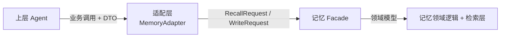

# 记忆模块对外接口

本文定义**适配层如何调用记忆模块**,以及对外暴露的 API 签名。核心约束:上层应用只通过适配层、只见 DTO,永远不碰记忆模块的领域模型。

## 调用关系



三个边界对象,层层翻译:

| 对象 | 在哪层 | 谁能看见 | 作用 |
|------|--------|---------|------|
| **DTO**(`adapter/dto.py`) | 适配层对外 | 上层应用 | 稳定对外契约,与内部解耦 |
| **Request/Result**(`facade.py` 入出参) | 适配层 ↔ Facade | 适配层 | 模块的稳定接口 |
| **领域模型**(`modules/memory/models.py`) | 记忆模块内部 | 仅记忆模块 | 领域逻辑 + LanceDB schema |

> **为什么要三层对象、显式翻译?** 它把"对外契约""模块接口""存储 schema"三件事解耦了。存储 schema 改字段(procedural 加列)不影响对外 API;对外 API 调整不影响 LanceDB 表结构。每层独立演进——这是"项目资产"长期可维护的关键。代价是多写转换代码,用 Pydantic `model_validate` / 简单 mapper 把成本压到最低。

## 适配层 API(本阶段:进程内 Python API)

本阶段适配层是**进程内 Python 库**(非 HTTP 服务,见 [project/overview](../../project/overview.md) Non-goals)。上层直接 import、`await` 调用。

```python
# adapter/dto.py(对外 DTO 草案)
from pydantic import BaseModel
from typing import Literal

class MemoryItem(BaseModel):
    """对外的记忆条目表示,屏蔽内部 schema 细节。"""
    id: str
    kind: Literal["semantic", "episodic", "procedural"]
    text: str
    score: float | None = None       # 仅检索返回时有
    metadata: dict = {}              # category/task_type/effectiveness 等

class WriteRequest(BaseModel):
    kind: Literal["semantic", "episodic", "procedural"]
    owner_id: str                    # user_id / session_id / agent_id
    text: str
    metadata: dict = {}              # 各 kind 专有字段
    namespace: str = "default"

class RecallRequest(BaseModel):
    owner_id: str
    query: str
    kinds: list[Literal["semantic", "episodic", "procedural"]] = ["semantic"]
    method: Literal["vector", "keyword", "hybrid"] = "hybrid"
    top_k: int = 10
    use_rerank: bool = False
    filters: dict = {}               # 翻译成 where 条件
    namespace: str = "default"

class RecallResponse(BaseModel):
    items: list[MemoryItem]
    method: str                      # 实际使用方法(便于调试)
    latency_ms: float
```

```python
# adapter/memory_adapter.py(适配层 API 草案)
class MemoryAdapter:
    def __init__(self, settings: KairosSettings):
        """从配置组装:factory 建 Provider/Store,注入记忆 Facade。
        组件不齐时 fail-fast(ConfigError/NotConfiguredError)。"""
        ...

    # ---- 写入 ----
    async def remember(self, req: WriteRequest) -> MemoryItem: ...

    # ---- 检索 ----
    async def recall(self, req: RecallRequest) -> RecallResponse: ...

    # ---- 会话生命周期 ----
    async def forget_session(self, session_id: str, *, distill: bool = False) -> None:
        """遗忘某次会话的情景记忆(episodic);distill=True 时先尝试沉淀为 semantic。
        注意:工作记忆(context 压缩)归应用层,不在此清理。"""
        ...

    # ---- 程序记忆(procedural) ----
    async def ingest_trace(self, trace: ExecutionTrace) -> list[MemoryItem]:
        """提交执行 trace,提炼为程序记忆(规则门控→LLM 抽取→去重写入)。
        返回提炼出的经验(可能为空)。"""
        ...

    async def reinforce(self, experience_id: str, *, success: bool) -> None:
        """程序记忆被复用后的反馈,更新 effectiveness/reuse_count。"""
        ...

    # ---- 维护(供后台任务) ----
    async def maintain(self) -> None:
        """周期性维护:LanceDB optimize() + episodic 归档/衰减 + procedural 衰减。"""
        ...
```

## 错误处理契约(对外)

适配层是错误的"翻译边界",把内部错误映射成对调用方有意义的形式(错误层级定义见 [foundation](../../foundation/foundation.md)):

| 内部错误 | 适配层处理 | 对调用方含义 | 未来 HTTP 映射 |
|---------|-----------|-------------|---------------|
| `ValidationError` | 直接抛(或转友好提示) | 你的输入有问题 | 422 |
| `NotConfiguredError` | 直接抛,带配置指引 | 服务没配好这能力 | 500(配置) |
| `ProviderError` | 记录 + 抛 | 外部依赖出错,可重试 | 502/503 |
| `ConfigError` | 启动时抛,fail-fast | 部署配置错误 | 启动失败 |

约定:底层 `lancedb`/`openai` 原始异常**绝不**穿透到上层——全在 provider 层封装成 `ProviderError`,否则上层会写出依赖具体实现的 except,破坏可插拔。输入校验由 DTO(Pydantic)+ 适配层完成。

## 端到端使用示例(上层视角)

```python
from kairos.foundation.config import KairosSettings
from kairos.adapter import MemoryAdapter
from kairos.adapter.dto import WriteRequest, RecallRequest

mem = MemoryAdapter(KairosSettings())   # 配置驱动,自动组装实现

# 写一条关于用户的长期偏好(语义记忆)
await mem.remember(WriteRequest(
    kind="semantic", owner_id="user_42",
    text="偏好简洁、直接的回答,不要冗长铺垫",
    metadata={"category": "preference"},
))

# 在对话中检索相关记忆
resp = await mem.recall(RecallRequest(
    owner_id="user_42", query="我喜欢什么样的回答风格?",
    kinds=["semantic"], method="hybrid", top_k=5,
))
for item in resp.items:
    print(item.score, item.text)
```

上层代码里**没有任何** `lancedb`、`openai`、RRF、embedding 维度的痕迹——全在 infra 内部。换向量库、换模型、改融合策略,这段上层代码一行不动。这就是解耦要达到的效果。

## 服务化演进(预留,不实现)

适配层是天然的服务化边界。未来若需 HTTP API:

- 用 FastAPI 把 `MemoryAdapter` 方法包成路由(`POST /v1/memory/recall` 等),DTO 直接复用为请求/响应体(已是 Pydantic 模型)。
- 上面错误映射表的"HTTP 映射"列直接生效。
- 对外 API 签名(DTO)不变,上层从"import 库"改为"发 HTTP 请求",业务语义一致。

本阶段不实现,但 DTO 用 Pydantic、错误已预映射,就是为这条路径铺好的路。整体演进见 [project/roadmap](../../project/roadmap.md)。

---

下一篇:[tradeoffs](./tradeoffs.md) — 技术取舍与依据来源。
