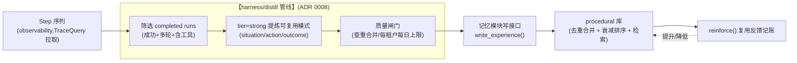
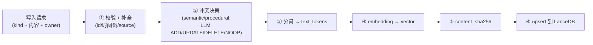

# 记忆类型设计

记忆模块管理三类**长期记忆**,每类有独立的写入触发、存储结构、检索方式、生命周期/淘汰策略。三类共享统一检索层(见 [retrieval](./retrieval.md))和统一存储抽象(LanceDB),但各自的领域逻辑分开,互不耦合。

> **本文承载的关键决策**(经研讨确定,见 ADR):
> - **按认知功能分类**(ADR 0006):先按生命周期切出**工作记忆**(归 harness 层的 Context Engine,见 ADR 0006 术语更新追记,不是 infra 存储)vs **长期记忆**;长期记忆内部按认知功能分三类——**语义 semantic**(关于用户的事实/偏好)、**情景 episodic**(发生过的对话/事件)、**程序 procedural**(从执行学到的策略)。
> - **不做知识图谱**(ADR 0004):记忆是扁平的原子事实,写入时用 LLM 驱动 ADD/UPDATE/DELETE/NOOP 做去重与冲突解决,不建实体关系图、不预留实体/关系字段。
> - **衰减管排序,冲突管删除**(ADR 0005):时间/使用衰减只用于检索时降权,不删记忆;真正的删除由语义冲突或生命周期触发。三类记忆据此分化。
> - **机制 vs 策略**(ADR 0007):记忆模块只提供**机制**(存、检索、去重、衰减排序);"**何时存、何时召回、什么值得记**"是**策略**,留在模块外(harness 层)。写入分 kind 不每轮无差别写;召回选择性、带门控,不每轮全量。
> - **procedural 评估/提炼解耦**(ADR 0008):trace 的采集/评估/提炼是**记忆模块之外**的独立关注点;模块对 procedural 只接收"已提炼、已评估的经验"——六层架构下的具体生产者是 harness/distill 管线(见 [distill](../../harness/distill.md))。
> - **作用域与隔离**(ADR 0009):单用户是多用户的退化情形,共用一套作用域(租户边界 + `owner_id` 实体)。隔离是机制(每次检索强制带作用域、缺则拒绝);跨用户共享是策略(留阶段二)。三类记忆 owner 语义不同(见下)。
> - **租户物理分表**(ADR 0013):租户轴用物理分表 `{tenant_id}__{kind}` 实现(drop 表即完成合规数据删除),用户轴用表内 `owner_id` 强制过滤——见下文 §Namespace 总规则。
>
> 设计目标是**高精确率、低噪音**(非召回率):宁可少返回、不可返回脏数据。这条取向贯穿三类记忆的检索与淘汰设计,并由 [benchmark](../benchmark/README.md) 验证。

## 分类轴:为什么是这三类

记忆分类沿**两级**展开(完整决策见 [ADR 0006](../../adr/0006-memory-classification-by-cognitive-function.md)):

```
第一级(生命周期)        第二级(认知功能,仅长期记忆内部)
─────────────────       ──────────────────────────────────
工作记忆 working    ──→  归 harness 层(Context Engine:窗口 + 压缩),infra 不存
长期记忆 long-term  ──→  semantic   语义:关于用户的事实/偏好("什么是真的")
                         episodic   情景:发生过的对话/事件("发生过什么")
                         procedural 程序:从执行学到的策略("怎么做")
```

- **主轴是认知功能**,因为它让"写入触发 / 检索方式 / 淘汰 / 衰减"四类操作行为聚类最干净——这正是当初要分 kind 的根本动机。
- **归属(用户/agent)不是分类轴,是字段 `owner_id`**;**垂直/场景**靠通用 `metadata`(scope 键值)与 Profile/Skill 表达(见下文);**生命周期/衰减**是每类的策略,不是主轴。
- **工作记忆(context 压缩)归 harness 层**(ADR 0006 及其术语更新追记),不是 infra 的存储 kind——上下文窗口的保留与压缩是 Context Engine 职责([harness/context](../../harness/context.md) §3)。这一刀把"短期 vs 长期"之争解决在源头:短期上下文 = 工作记忆 = harness 管;真正需要 infra 持久化的是"离开 context 就会丢"的长期记忆。

> **术语对齐(供老设计读者)**:`semantic`=原 `personal`,`episodic`=原 `session`(已解开"短命"耦合,见 episodic 一节),`procedural`=原 `experience`。代码标识用英文学界术语,文档中文名:语义/情景/程序记忆。

## 垂直化:基座 + 垂直分层

记忆模块是 infra,本身**就是"个人助手"那一层基座**;垂直助手在它之上叠加,不 fork。

```
教育助手 = 个人助手(基座)+ 教育垂直(扩展)
            └ 记忆模块提供       └ 内容 + scope metadata + Profile/Skill/persona + benchmark
```

- **infra 固定的是结构,不是内容**:三类记忆(semantic/episodic/procedural)、共享基类字段、通用 `category`(fact/preference/profile)跨垂直不变。
- **垂直差异只体现在"写什么内容"和 benchmark 场景,不体现在 schema**:个人助理记用户偏好,教育助手记教师的教学偏好/学段学科/班级观察——都是 `semantic` 里的原子事实,**同一套 schema、同一个 owner、同一个库共存**,靠 `category` / `metadata` 区分。
- **扩展机制是通用 `metadata`(scope 键值对,如 `{"class": "高二3班", "subject": "物理"}`),不是加表、不给垂直加专属字段。** 允许哪些 scope 键由 Profile 的 `memory_namespace.scope_metadata_keys` 白名单声明([assembly/profile](../../assembly/profile.md)),值的推断与降级规则见 [harness/context §5.1](../../harness/context.md)——**教育语义不进 memory 模块,这是"底座零行业耦合"的验收点之一**。第三个垂直进来,infra 零改动。

> **为什么不给垂直 fork schema?** 见 [tradeoffs](./tradeoffs.md#为什么不给垂直-fork-schema暂不加-subject_id)。要点:垂直差异是内容差异,不是结构差异;给每个垂直加字段会让 schema 随业务膨胀,违背解耦与 YAGNI。同理本阶段**不引入 `subject_id`**——当前两个垂直(个人助理、教师教学设计助手)的记忆主体都主要是用户本人,班级/学科/年级用 scope `metadata` 表达即可;等真出现"以单个学生为主体长期追踪"的需求再触发。

> **记忆 vs 领域知识的边界(教育垂直尤其关键)**:记忆只记**"关于用户的 / 会话的 / 从执行学到的"**且**积累出来的**内容。教材、课程标准、知识点体系这类**静态、外部权威、按需检索的参考数据**不进记忆模块,归 [knowledge 模块](../knowledge.md)(判据:**内容换个用户仍成立 → knowledge,否则 → memory**)。这条线不画清,垂直会把整个领域知识库往记忆里塞,记忆模块会失焦。

## 三类记忆总览

| 维度 | 语义记忆 `semantic` | 情景记忆 `episodic` | 程序记忆 `procedural` |
|------|---------------------|---------------------|----------------------|
| **本质** | 关于用户的去情境化事实与偏好 | 发生过的对话/事件历史 | 从 Agent 执行 trace 提炼的可复用策略 |
| **认知功能** | "什么是真的" | "发生过什么" | "怎么做" |
| **个人助理 例** | "偏好简洁回答""在做 Python 项目" | 上次会话贴过某段报错日志、讨论过的方案 | "帮用户订票先确认日期再查价成功率高" |
| **教育助手 例** | "教高一数学""偏好苏格拉底式提问""所带班几何整体弱" | 上次备课讨论过的课题、生成过的教案草稿 | "给基础弱的班讲分数,先实物类比再上符号,接受度高" |
| **生命周期** | 长期(冲突时更新/废弃,不按时间过期) | 中长期(衰减/可归档,不靠时长定生死) | 中长期(强度衰减,低效则淘汰) |
| **写入触发** | run 后异步抽取(`run_extract`)+ 显式写入(`agent_explicit`) | run 会话摘要 + 压缩摘要段,过显著性门控(保持原始) | **仅 distill 管线**(`distill`,run 内不直接产生) |
| **owner** | 用户 | 用户(可跨会话) | Agent |
| **作用域/可共享性** | `owner_id=user_id`,租户表内私有 | `owner_id=user_id`,租户表内私有 | owner **二选一**:私有 `f(agent_id,user_id)` / 全局技能 `agent_id`;本阶段仅私有 |
| **检索默认方法** | hybrid(主精确率层) | recency+relevance(兜底召回层) | hybrid |
| **删除由谁触发** | 语义冲突(LLM 驱动 UPDATE/DELETE) | 衰减归档 / 显式清理 | 低强度长期低效(soft delete) |
| **衰减用途** | recency 仅检索时轻微降权 | recency 较强降权 + 可归档 | 强度衰减 + 使用强化,用于排序与淘汰 |

> **工作记忆去哪了?** context 窗口的保留与压缩是**harness 层 Context Engine**的职责(ADR 0006 及术语更新追记),不是 infra 的存储 kind。infra 只负责"离开 context 会丢"的长期记忆。情景记忆(episodic)是工作缓冲的**无损可检索后备**:压缩把细节丢了,还能从 episodic 精确捞回——但它**不等于**工作缓冲本身。

> **为什么三类分开而不是一张表?** 三类的**写入/检索/淘汰行为根本不同**(ADR 0006):语义靠 LLM 冲突更新、不按时间删;情景靠显著性门控写入 + 兜底召回;程序靠强度衰减 + 使用强化。塞进一张表会让这些逻辑互相打架(ADR 0005)。分 kind 让每类策略独立演进;共性(向量列、BM25 列、owner 分区、检索方式)通过共享基类和统一检索层复用。

## 写入与召回时机:机制在内,策略在外(ADR 0007)

记忆效果取决于两件事——**高质量的记忆数据** + **召回的时机**。但二者是**策略**(依赖业务与上下文的判断),不是**机制**(确定的存取能力)。[ADR 0007](../../adr/0007-memory-mechanism-vs-policy-timing.md) 据此划界:记忆模块提供机制(`MemoryStore` / `Retriever` / `RecallRouter`),"何时存、何时召回"由模块外(harness 层)决定。

**写入矩阵(分 kind + 分来源,绝不每轮无差别写)**:每条写入带 `source: MemorySource`(见 [api](./api.md)),支撑幂等去重与按来源回滚。

| 记忆 | 写入来源与时机 | 形态 |
|------|---------|------|
| semantic | ① `run_extract`:run FINISHED 后 Context Engine **异步**抽取([context §5](../../harness/context.md));② `agent_explicit`:`save_memory` 工具(用户显式"记住") | harness 触发,不在对话每轮跑 |
| episodic | `run_extract`:run 会话摘要 + 压缩摘要段,过**显著性门控**,**保持相对原始、不做重抽取** | Context Engine 写回时落盘,门控打 `salience` |
| procedural | **仅 `distill`**:离线管线评估/提炼后写入([distill](../../harness/distill.md),ADR 0008);**run 内不直接产生 procedural** | 模块只收"已提炼经验" |

> 高质量记忆的第一道闸是**克制写入**:宁可漏写,不写脏。决定"何时算定型、何时触发"的是 harness(策略);模块只提供能力(机制),并执行配额与幂等的最终裁决(见 [api §配额责任归属](./api.md))。

**召回时机(选择性,不每轮全量)**:每轮把所有相关记忆灌进 context 会因 Lost-in-the-Middle / 近似干扰项 / context rot 而损害精确率(证据见 [retrieval §选择性召回](./retrieval.md#选择性召回recallrouter-与-memory-as-a-tool))。因此召回是选择性的:proactive 路径由 Context Engine 在新用户消息时检索一次,tool 路径由模型自主决定调用 `search_memory`——两条路径消费同一 `Retriever` 契约(见 [api §双召回路径](./api.md))。模块另提供可插拔的 `RecallRouter`(MVP 薄启发式)供 proactive 路径复用——详见 retrieval。

## Namespace 总规则:租户物理分表 + 用户逻辑过滤(ADR 0013)

记忆的作用域沿两条正交轴展开,物理实现分工不同:

| 轴 | 边界 | 物理实现 |
|----|------|---------|
| **租户轴**(tenant) | 信任边界、合规边界 | **物理分表**:表名 `{tenant_id}__{kind}`,provider 层按 ctx 路由,越权需拿错表名 |
| **用户轴**(owner) | 同租户内实体归属 | **逻辑过滤**:表内 `owner_id` 字段,provider 层内部强制注入 prefilter,调用方无法绕过 |

- **为什么租户用物理分表?** drop 表即完成租户注销/数据删除
  (教育行业合规刚需);租户间索引/compaction 互不影响;
  LanceDB 表即目录,数百租户量级无运维压力。共享表 + 过滤字段
  方案被否,见 [tradeoffs](./tradeoffs.md) 与 ADR 0013。
- **三 kind 的淘汰策略均按 namespace(租户表)独立执行**,
  不跨租户/跨用户竞争。
- 文中"namespace 内"一律指"同一租户表内"。

## 单/多用户作用域与 owner 语义(ADR 0009)

**单用户是多用户的退化情形,不做两套设计。** 单租户单用户时所有记忆落在(默认租户表, `owner_id=该用户`);多租户/多用户只是表路由与字段取不同值(与"基座+垂直分层"同构)。

把两件不同性质的事分开([ADR 0009](../../adr/0009-single-multi-user-scoping-isolation.md)):

- **隔离 = 机制(现在做)**:用户 A 永远看不到 B 的记忆。租户经表路由物理隔离,表内检索强制带 `owner_id` prefilter,ctx 缺失则拒绝(fail-closed),作用域从可信上下文(`ctx: TenantContext`,server 唯一构造)派生。详见 [retrieval §作用域隔离](./retrieval.md#作用域隔离每次检索必带作用域缺则拒绝)。
- **共享 = 策略(留阶段二)**:跨用户复用经验。默认关闭。

**三类记忆 owner 语义**:

| kind | owner | 可共享性 | 本阶段 |
|------|-------|---------|--------|
| semantic | `user_id` | 私有("领域/团队事实"不是记忆,归 [knowledge 模块](../knowledge.md),见 ADR 0006) | 仅私有 |
| episodic | `user_id` | 私有(情景天然个人专属) | 仅私有 |
| procedural | **二选一** | 私有 `f(agent_id,user_id)` / 全局技能 `agent_id`(租户表内跨用户) | **仅实现私有**;全局留接口位 |

> **为什么 procedural 默认私有、全局共享是显式 opt-in?**(ADR 0009)① default-deny 的延伸;② 全局共享必须先**去标识化**(否则把私密提炼进共享池——业界与 OWASP 都警告),而去标识是**模块外评估 pipeline 的职责**(ADR 0008)——记忆模块只存"已脱敏经验"。所以全局共享天然依赖那条尚未建设的 pipeline,本阶段做私有更干净;`ProceduralMemory` 的 `agent_id` 字段已能表达全局 owner,留接口位 + TODO 即可,无需现在改 schema。

> **不做(YAGNI)**:组织/全局三层继承式检索(业界无成熟范式)、跨用户脱敏共享池(依赖 ADR 0008 distill 脱敏,阶段二)。但租户表命名前缀层级化(未来 `org_school_a__...`)不堵死。

## 共享数据模型基础

所有 kind 的 LanceDB 表共享一组基础字段,用 `LanceModel`(LanceDB 原生支持 Pydantic 风格 schema【已验证:LanceDB docs】)定义基类。**表按 `{tenant_id}__{kind}` 物理拆分**(ADR 0013),租户不是表内字段:

```python
# modules/memory/models.py(草案)
from lancedb.pydantic import LanceModel, Vector
from typing import Literal

EMBED_DIM = 1024  # 与 EmbeddingConfig.dim 一致,启动校验

class MemoryBase(LanceModel):
    # ---- 主键与归属(租户不在表内:由表名 {tenant_id}__{kind} 承载) ----
    id: str                       # 全局唯一:f"{owner_id}:{kind}:{ulid}"
    kind: Literal["semantic", "episodic", "procedural"]
    owner_id: str                 # 同租户内实体归属(user/agent),强制过滤字段

    # ---- 通用 scope 元数据(对 infra 无语义,键由 Profile 白名单声明) ----
    metadata_kv: list[str] = []   # "key:value" 编码,如 ["subject:物理","class:高二3班"]
                                  # 对外 DTO 呈现为 dict[str,str];编码/过滤翻译是 provider 细节

    # ---- 写入来源(幂等去重 + 按来源回滚) ----
    source: str                   # MemorySource: run_extract | agent_explicit | distill
    source_run_ids: list[str] = []

    # ---- 检索字段(双字段 BM25,借鉴 EverOS) ----
    text: str                     # 原始展示文本(给人/LLM 看)
    text_tokens: str              # 预分词、空格连接(FTS/BM25 索引建在这列)
    vector: Vector(EMBED_DIM)     # 语义向量(cosine ANN)

    # ---- 内容指纹(增量 re-embed 优化 + 幂等去重,借鉴 EverOS) ----
    content_sha256: str           # 仅对内容字段哈希;审计字段变更不触发 re-embed

    # ---- 生命周期 ----
    created_at: float
    updated_at: float
    expires_at: float | None = None   # None=不过期;episodic 归档/保留窗可用它
    deprecated: bool = False          # 软删除/废弃标记
```

**双字段 BM25 方案**(借鉴 EverOS):`text` 存原始文本供展示,`text_tokens` 存预分词结果(中文 jieba),FTS 索引建在 `text_tokens`。**为什么拆两列?** 分词策略在模块内可切换,LanceDB FTS 用 whitespace tokenizer 读已分好的 `text_tokens`——换分词器只需重算这一列,不动 schema、不依赖库内置分词器的语言支持。

**`content_sha256`**(借鉴 EverOS):只对参与语义的内容字段哈希。仅审计字段(`updated_at` 等)变动时哈希不变,re-reconcile 时跳过重新 embedding,省调用成本。同时是幂等键的一部分:同 `(source, source_run_ids, content_sha256)` 重复写入不产生新条目(契约测试固化)。

**`metadata_kv`**(通用 scope 元数据):对 infra 无语义的键值对(教育用 `subject/class/term`,个人助理用 `project` 等),对外 DTO 呈现为 `metadata: dict[str, str]`,检索时经 `MetadataFilter` 等值下推(见 [retrieval](./retrieval.md))。比扩 `category` 枚举更灵活,且不让 infra 认识业务概念。**【待验证】**:LanceDB 对 list 列的 `where` 过滤语法(`array_contains` 或等价 SQL),落地前需确认;若不支持,退化为常用 scope 键展开为独立标量列(provider 内部细节,不影响契约)。

> **来源**:LanceModel / Vector 列 / FTS(BM25)/ cosine ANN 均为 LanceDB **已验证**能力,见 [tradeoffs](./tradeoffs.md)。双字段 BM25、content_sha256 借鉴 EverOS 源码(`tables/episode.py`),见 [everos-analysis](./everos-analysis.md)。

## 语义记忆 (semantic)

> 关于用户的、去情境化的长期事实与偏好。"什么是真的"。例:"偏好简洁回答"、"在做 Python 项目"、"母语中文"。对应认知科学的 semantic memory(Tulving 1972),原 `personal`。

### 记什么(内容范畴)

语义记忆聚焦三类**长期稳定**的内容(用 `category` 区分),它们也对应 benchmark 的用户属性本体:

| category | 含义 | 例 | 特点 |
|----------|------|----|------|
| `fact` | 客观属性事实 | "母语中文""在做 Python 项目" | 较稳定,变化时需更新 |
| `preference` | 偏好/习惯 | "喜欢简洁回答""不喜欢冗长铺垫" | 影响 Agent 行为;PrefEval 类基准专门测它 |
| `profile` | 阶段性画像 | "现在的工作是后端工程师" | 最易随时间变化、被新信息推翻(对应 KU 能力) |

不记什么:发生过的对话/事件本身(那是 episodic 记忆);Agent 自己的执行策略(那是 procedural);世界通用知识/领域资料(教材、课标——归 [knowledge 模块](../knowledge.md),见 §垂直化)。**边界清晰是低噪音的前提**——记错了类别,检索时就会污染结果。

> **不做实体关系**(ADR 0004):语义记忆是**扁平的原子事实**,不建"用户—关系—实体"的图。调研显示图只在时序/多跳推理上有局部增益,却带来 token 翻倍、延迟翻倍、抽取污染等全局代价。扁平事实 + LLM 驱动的冲突更新已能覆盖 MVP 需求;图作为后续叠加层,需求出现再做。

### 数据模型

```python
# modules/memory/kinds/semantic.py(草案)
class SemanticMemory(MemoryBase):
    kind: Literal["semantic"] = "semantic"
    category: str = "fact"        # fact | preference | profile
    confidence: float = 1.0       # 抽取置信度(显式写入=1.0)
    last_used_at: float | None = None  # 最近被命中时间(价值评估)
```

### 写入触发

两条路径(写入矩阵),都汇入统一写入管线:

1. **`agent_explicit`(显式写入)**:模型经 `save_memory` 工具、或用户明确要求"记住"时调用 `remember(ctx, ...)`,`confidence=1.0`。
2. **`run_extract`(run 后抽取)**:run FINISHED 后,Context Engine 以 tier=fast 模型从 Step 序列**异步**抽取候选事实/偏好([context §5](../../harness/context.md)),连同推断的 scope metadata 一起经 `remember` 写入。**抽取的智能在 harness,模块只收产物**——与 ADR 0007"机制在内、策略在外"一致。

> **取舍**:不做对话每轮实时抽取与持续演进(Non-goal)。每轮抽取易写入噪声、产生冲突,需配套去重/反思机制才稳妥,成本高。"何时抽取、抽什么"的决策权在 harness,infra 只提供写入能力与幂等/配额裁决。

### 检索路径

默认 `method=hybrid`(向量 + BM25 + RRF),租户经表路由隔离、表内强制 `owner_id` 过滤、`deprecated=False`;可选 `category` 与 `MetadataFilter` 等值过滤(召回阶段下推,见 [retrieval](./retrieval.md))。命中后异步更新 `last_used_at`,不阻塞返回。语义记忆是检索的**主精确率层**——干净、去重、可信。

**recency 仅作轻微降权**(ADR 0005):检索排序时,`last_used_at` 越久远的给一个温和的降权系数,让近期相关的事实略微靠前——但**不删除**老事实(用户生日不会因为很久没提就失效)。降权幅度保守,避免把仍然正确的稳定事实压没。

### 写入与淘汰:LLM 驱动的 ADD/UPDATE/DELETE/NOOP

语义记忆**不按时间自动过期**(长期稳定是其定义)。写入与冲突处理合一,借鉴 Mem0 基础版的做法(ADR 0004):新事实进来时,先向量检索 top-K 相似的已有记忆,再由 **LLM 在四种操作中决策**:

| 操作 | 触发条件 | 效果 |
|------|---------|------|
| **ADD** | 新事实,与已有不重复 | 新增条目 |
| **UPDATE** | 与已有事实相同主题但值变化(如换了工作) | 更新旧条目的 `text`/`updated_at`,取高 `confidence` |
| **DELETE** | 新事实**推翻/矛盾**旧事实 | 旧条目 `deprecated=True`(软删除) |
| **NOOP** | 新事实是已有的重复/子集 | 不动 |

这一套同时解决**去重**(UPDATE/NOOP 防止同一事实反复堆积)和**冲突删除**(DELETE 处理事实变更)——这正是 ADR 0005 说的"冲突管删除":删除由语义冲突触发,而非时间。

> **为什么用 LLM 决策而不是阈值规则?** 纯相似度阈值只能判"像不像",判不了"是更新还是矛盾还是补充"。"我搬到上海了"和"我在北京"——向量相似但语义是**取代**关系,需要 LLM 才能识别为 UPDATE/DELETE 而非 ADD。这是低噪音的关键:防止矛盾事实并存污染检索。
>
> **代价与缓解**:每次写入多一次 LLM 调用 + 一次向量检索。缓解:仅对 top-K 候选(K 小)做判断;`content_sha256` 完全相同则直接 NOOP 跳过 LLM;批量写入可合并。具体阈值 K、是否所有写入都过 LLM,由 benchmark 校准。

> **为什么不设容量上限?** 关于用户的长期事实总量通常有限,冲突更新足以控规模。若未来某用户量级异常,再引入"低 confidence + 长期未命中"清理——预留扩展,本阶段不做。

## 情景记忆 (episodic)

> 发生过的对话/事件历史。"发生过什么"。例:上次会话贴过的报错日志、讨论过的方案、上次备课定的课题。对应认知科学的 episodic memory(Tulving 1972),原 `session`——但**已解开"短命"耦合**,见下。

### 与"工作记忆"的关系(这是研讨的关键澄清)

旧设计里的 `session` 把两件事焊在了一起,本次按 ADR 0006 拆开:

| | 工作记忆 working | 情景记忆 episodic |
|---|---|---|
| 是什么 | 当前 context 窗口里的消息 | 落盘、可检索的对话/事件历史 |
| 谁管 | **harness 层 Context Engine**(保留 + 压缩,[context §3](../../harness/context.md)) | **记忆 infra**(本节) |
| 解决 | 这一轮 prompt 塞什么 | 压缩丢了的细节怎么精确捞回 |
| 生命周期 | 随 context 滚动 | 中长期,不靠时长定生死 |

> **为什么 episodic 不再"短命"?** 因为"短命"是把生命周期焊进了分类(ADR 0006 指出的病根)。情景记忆的本质是"事件发生过",事件并不天然短命(Generative Agents 的 memory stream 就是长期情景流)。它的定位是工作缓冲的**无损可检索后备**:context 压缩是有损的,压缩把第 N 轮的某个具体参数丢了,光靠 context 找不回——episodic 让你用检索精确捞回。

### 记什么(内容范畴)

情景记忆记**发生过的、未来可能要精确回溯**的对话/事件:

- 讨论过的方案、贴过的代码/日志、定过的临时约定
- 跨会话仍可能被引用的事件("上次我们说的那个办法")
- 尚未沉淀为语义事实、但值得留痕的过程信息

它与语义记忆的关系是**晋升**:值得长期保留的事实可从情景中抽取成 `semantic`(见下文)。区分二者很重要——把过程性事件误存为语义事实,会长期污染画像;把长期事实只留在情景里,检索精确率层就缺了它。

> **显著性门控(写入的关键)**:**不是每轮对话都写 episodic**。原始对话噪声高,无门槛 append 会污染检索、拉低精确率(直接违背低噪音目标)。写入前过一道轻量显著性判断(规则为主:含代码/错误/决策/被显式标记的内容优先;纯寒暄过滤)。门控让 episodic 保持"值得回溯"而非"全量日志"。

> **门控筛"写不写",不改"写什么":episodic 保持相对原始,把智能放检索端。** 通过门控的内容**原样落盘**,不在写入时做重抽取/改写——这呼应 *Storage Is Not Memory*(arXiv 2605.04897)的警示:在摄入端就加工,会在写入端丢信息、检索端找不回。episodic 的定位是"无损可检索后备"(ADR 0006),所以智能放在检索端(recency+relevance+salience 加权、可选 rerank),而非写入端。这与 procedural 不同:procedural 的本质就是从 trace 蒸馏可复用模式(见下文),但提炼放在**模块外**且保留原始 trace 兜底(ADR 0008)。

### 数据模型

```python
# modules/memory/kinds/episodic.py(草案)
class EpisodicMemory(MemoryBase):
    kind: Literal["episodic"] = "episodic"
    session_id: str               # 事件发生的会话边界
    turn_index: int               # 会话内轮次序号(时序检索)
    role: str = "user"            # user | assistant | tool
    salience: float = 0.5         # 显著性评分(门控写入 + 检索加权)
```

`owner_id` 是用户(可跨会话回溯同一用户的历史);`session_id` 标记事件发生在哪次会话,供"限定本会话"或"跨会话"两种检索。

### 写入触发

- **写入矩阵路径 `run_extract`**:run 会话摘要与 history 压缩产生的摘要段([context §3/§5](../../harness/context.md)),经显著性门控后由 Context Engine 写回。`salience` 由门控打分。
- **追加式,不做 LLM 冲突决策**(事件有时序意义,不像事实需要去重/取代);幂等由 `(source, source_run_ids, content_sha256)` 保证。

### 检索路径

情景记忆是**兜底召回层**(不是主精确率层):

- 可按 `session_id` 过滤(限定本会话)或跨会话(回溯同一 `owner_id` 的历史)。
- 检索按 **recency + relevance** 加权(借鉴 Generative Agents / CoALA 的 episodic 检索),叠加 `salience`。
- 两种典型用法:**时序召回**(按 `turn_index` 取最近 N 轮,纯标量查询);**语义召回**(向量/hybrid)。
- **定位**:语义记忆答不上来时,再 reach into 情景层补充上下文。它服务召回兜底,不当主源——避免过程性噪声进入精确率层。

### 淘汰策略

按 ADR 0005,情景记忆**不靠时长硬删**,而是衰减归档 + 显式清理:

1. **recency 较强降权 + 可归档**:久未命中的情景条目检索时强降权;超出保留窗或低 `salience` 的可批量归档(`deprecated=True` 或转冷存储)。比语义记忆的降权激进——情景是"过程留痕",时效性比客观事实强。
2. **显式清理**:上层可调 `forget_session(session_id)` 批量清理某次会话的情景记忆(如用户要求遗忘)。
3. **可选沉淀**:Context Engine 的 run 后抽取(`run_extract`)可把情景里值得长期保留的事实晋升为 `semantic`(harness 侧策略,见 [context §5](../../harness/context.md))。

> **为什么不再用 24h TTL 硬淘汰?** 那是 `session` 把"短命"当本质时的产物。解耦后,情景记忆的去留由"是否还可能被精确回溯"决定(衰减 + 显著性),而非一刀切的时间阈值。需要"会话结束即清"的场景,用 `forget_session` 显式表达,语义更清晰。

> **为什么 TTL 用维护任务清理而不依赖库?** LanceDB 无原生 TTL【已验证:文档未见】。与其等库特性,不如用 `delete(where=...)`——简单、可控、可观测。代价是需调度一个清理任务(`maintain`),这任务同时承担 LanceDB `optimize()` 维护职责(见下文 §维护),一举两得。

## 程序记忆 (procedural)

> 从 Agent 执行 trace 提炼的可复用策略。"怎么做"。例:"处理 XX 任务先查 A 再做 B 成功率高"、"遇 YY 报错改用 ZZ 解决"。对应认知科学的 procedural memory(Squire/Cohen),原 `experience`。三类里最特殊——原料不是用户输入,而是 **Agent 自己的执行轨迹**。

### 数据模型

```python
# modules/memory/kinds/procedural.py(草案)
class ProceduralMemory(MemoryBase):
    kind: Literal["procedural"] = "procedural"
    task_type: str                # 任务类型标签(检索过滤)
    situation: str                # 适用情境描述(检索主要匹配这部分)
    action: str                   # 策略内容("采取了什么动作")
    outcome: str                  # 结果如何
    success: bool                 # 成败标签
    reuse_count: int = 0          # 被复用次数
    effectiveness: float = 0.5    # 有效性评分(0~1),随复用反馈更新
    merge_count: int = 1          # distill 查重合并计数(合并时递增)
    # 来源 run 集合在基类 source_run_ids(合并时取并集,兜底回溯)
```

`text`/`text_tokens`/`vector` 由 `situation`(+可选 `task_type`)生成——**检索主要按"适用情境"匹配**,因为 Agent 检索经验是为回答"我现在的情况,以前怎么处理"。owner 语义:私有 `f(agent_id, user_id)` 编入 `owner_id`(本阶段仅私有,ADR 0009)。

### 经验从哪来:评估/提炼在模块外,生产者是 distill 管线(ADR 0008)

**关键边界:把一条原始执行 trace 评估、提炼成"值得记的经验",是质量评估(策略),不是存储能力(机制)。** 因此这条链路**不在记忆模块内**——记忆模块对 procedural 只暴露"写入一条已提炼、已评估的经验"(`write_experience`,见 [api](./api.md)),所有"决定记什么经验"的智能在模块外。六层架构下,这个"模块外"落定为 **harness/distill 管线**(跨 observability + memory 的离线编排,见 [distill](../../harness/distill.md)),**run 内不直接产生 procedural**。



- **trace(Step)持久化在 observability 模块**;**筛选/评估/提炼在 distill 管线**;**查重合并/写入/衰减/检索/强化记账在记忆模块内**(机制)。三段边界见 [ADR 0008](../../adr/0008-procedural-evaluation-decoupling.md)。
- **保留原始 trace 兜底**:`source_run_ids` 回指来源 run(合并时取并集),提炼丢了的可经 TraceQuery 回溯;且提炼在模块外、可独立改进、可重跑,不是一次性焊死(缓解 *Storage Is Not Memory* 的摄入端加工风险)。带来源标记也使**按来源回滚**(删除某批 distill 产物)可行。
- **评估不盲信单次 LLM 打分**:LLM-as-judge 有偏置与不稳定(arXiv 2412.12509 等),distill 评估要么多次采样、要么以真实执行结果(success 信号)兜底。

> **v1 范围(YAGNI)**:distill v1 为人工触发、无审核界面(Phase 3 落地,见 [roadmap](../../project/roadmap.md));质量闸门=查重合并 + 每租户每日上限(默认 5)+ 失败静默跳过。**不外接评估平台、不建独立评估模块**,形态确有需要时再议。

### 复用反馈(reinforce,机制)

一条经验被检索命中、被 Agent 采用且本次执行成功时,harness 回调 `reinforce(ctx, experience_id, success=True)`,提升 `effectiveness`/`reuse_count`;反之降低(简单指数移动平均,复杂信用分配列为扩展)。**这是程序记忆区别于另两类的关键——它会"越用越准"。** 记账逻辑是机制(在模块内);"何时调用"由 harness 决定(策略)。

### 检索路径

默认 `method=hybrid`,主要匹配 `situation`;租户表路由 + 强制 `owner_id` 过滤,可选 `task_type`;可叠加 `effectiveness` 阈值(只取靠谱经验)和按 `effectiveness` 加权排序。

### 淘汰策略

程序记忆用**强度衰减 + 使用强化**(ADR 0005,借鉴 MemoryBank 的 Ebbinghaus 模型 R = e^(−t/S)):

1. **强度衰减**:每条经验有一个隐含的"记忆强度",长期未被命中则强度随时间衰减,检索时降权;被复用且成功则强度 `S` 增大(reinforce),衰减变慢——**越用越可信,久不用则可疑**。这与语义记忆的 recency 降权不同:程序记忆的衰减更激进,因为它是"启发式假设"而非"客观事实"。
2. **低效淘汰(soft delete)**:`effectiveness` 长期低于阈值的经验标记 `deprecated`。这是程序记忆**唯一会被主动删除**的情形——不是因为"老",而是因为"被证明没用"。
3. **容量上限**:每个 `agent_id` 经验条数设软上限,超限时淘汰强度/effectiveness 最低的。

> **为什么程序记忆会主动删除,语义记忆不会?**(ADR 0005)程序记忆是"启发式假设",可能过时、可能本就是噪声;留太多低效经验会污染检索、误导 Agent——直接损害精确率。语义事实是"用户客观属性",数量有限且久不提仍可能正确,所以语义记忆只降权不删、删只由冲突触发。不同本质决定不同淘汰哲学。

## 统一写入路径与维护

三类记忆共享一条**统一写入管线**(在 `store.py` 收口):



- **冲突决策**对 semantic/procedural 生效(向量检索 top-K 候选 → LLM 决定 ADD/UPDATE/DELETE/NOOP,见 semantic 一节),episodic 跳过(追加式,仅过显著性门控)。`content_sha256` 完全相同直接 NOOP,省一次 LLM 调用。
- **embedding** 通过 `EmbeddingProvider` 抽象,批量+并发(见 [retrieval](./retrieval.md))。
- **upsert** 用 LanceDB `merge_insert`(按 `id` upsert【已验证】)。

### 索引维护(关键运维点)

LanceDB OSS 的 FTS/向量索引对新增数据**不会自动并入索引**,需定期 `optimize()`,否则未索引部分走 flat scan、随增长变慢【已验证:LanceDB docs,经验法则约每 10万行变更或 20 次写 optimize 一次】。因此:

- 设**后台维护任务**,周期对各表 `optimize()`,顺带做 episodic 归档/衰减、procedural 强度衰减。
- 维护任务设 `index_cache_size_bytes` 上限(默认 16MB),防 `optimize()` 累积 reader FD 泄漏到 EMFILE(借鉴 EverOS 实测)。

> **这是选 LanceDB OSS 的主要工程代价**:索引维护要自己调度(自动维护是 Enterprise 特性)。详见 [tradeoffs](./tradeoffs.md)。

## 本阶段实现 vs 预留扩展

| 能力 | 本阶段 | 预留扩展 |
|------|--------|---------|
| 三类记忆 CRUD + 检索 + 淘汰 | ✅ | — |
| 工作记忆(context 压缩) | ✅ 归 harness 层 Context Engine(ADR 0006),infra 不存 | infra 统一调度(MemGPT 式 paging) |
| 写入冲突决策(semantic/procedural) | ✅ LLM 驱动 ADD/UPDATE/DELETE/NOOP | 语义聚类去重 |
| episodic 显著性门控 | ✅ 规则门控 | LLM/学习式显著性打分 |
| 从对话抽取语义记忆 | ✅ Context Engine run 后抽取(`run_extract`),harness 触发 | 自动抽取 + 冲突消解 |
| trace 评估/提炼程序记忆 | ✅ **harness/distill 管线**(v1 人工触发);模块只收已提炼经验(ADR 0008) | 独立评估模块 / observability 平台 / 自动分段、反思循环、信用分配 |
| 召回时机门控 | ✅ RecallRouter 薄启发式 + memory-as-a-tool(ADR 0007) | LLM/训练式路由(Self-RAG/Adaptive-RAG/UAR) |
| 租户/用户隔离 | ✅ 租户物理分表(ADR 0013)+ 表内 owner_id 强制过滤 + fail-closed + 契约测试(ADR 0009) | 完整 RBAC/鉴权/配额(server 层) |
| 多用户记忆共享 | ❌ 本阶段仅私有(ADR 0009) | procedural 全局技能池 + 去标识脱敏(随 distill 脱敏,阶段二) |
| 程序记忆衰减/强化 | ✅ 强度衰减 + 使用强化(EMA) | 复杂强化式打分 |
| recency 降权排序 | ✅ 语义记忆轻微 / 情景记忆较强降权 | importance 因子、三因子打分 |
| 记忆演进(合并/反思) | ❌ Non-goal | 后续 |
| 知识图谱 / 实体关系 | ❌ 不做(ADR 0004) | 后续叠加层(需求出现再做) |
| 垂直适配 | ✅ 通用 scope metadata + Profile/Skill,不 fork schema | subject_id(以单个主体长期追踪时再加) |

> 三类记忆的设计取舍依据见 [ADR 0006](../../adr/0006-memory-classification-by-cognitive-function.md)(分类轴)、[ADR 0004](../../adr/0004-no-knowledge-graph-mvp.md)(不做图)、[ADR 0005](../../adr/0005-decay-ranking-conflict-deletion.md)(衰减/删除分离)、[ADR 0007](../../adr/0007-memory-mechanism-vs-policy-timing.md)(时机归策略、选择性召回)、[ADR 0008](../../adr/0008-procedural-evaluation-decoupling.md)(procedural 评估/提炼解耦)与 [ADR 0009](../../adr/0009-single-multi-user-scoping-isolation.md)(单/多用户作用域与隔离);效果由 [benchmark](../benchmark/README.md) 验证。

---

下一篇:[retrieval](./retrieval.md) — 统一检索层与可插拔模型抽象。
