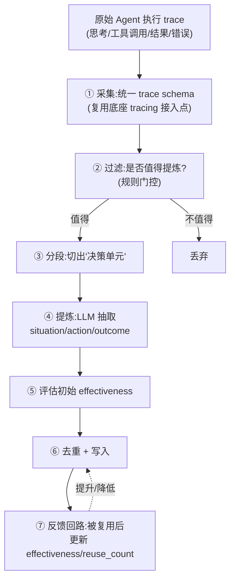
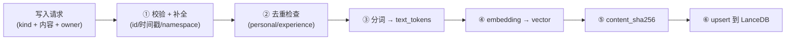

# 记忆类型设计

记忆模块管理三类记忆,每类有独立的写入触发、存储结构、检索方式、生命周期/淘汰策略。三类共享统一检索层(见 [retrieval](./retrieval.md))和统一存储抽象(LanceDB),但各自的领域逻辑分开,互不耦合。

## 三类记忆总览

| 维度 | 长期个人记忆 `personal` | 短期会话记忆 `session` | 执行经验 `experience` |
|------|------------------------|----------------------|----------------------|
| **本质** | 跨会话、长期稳定的用户事实与偏好 | 单次会话内的上下文 | 从 Agent 执行 trace 提炼的可复用经验 |
| **生命周期** | 长期(可更新/废弃,不自动过期) | 短(随会话结束 / TTL 清理) | 中长期(随有效性衰减,可淘汰) |
| **写入触发** | 显式写入 + 从对话抽取 | 会话过程中持续追加 | 异步从 trace 提炼 |
| **owner** | 用户 | 会话(session) | Agent |
| **检索默认方法** | hybrid | 多为时序/会话过滤,可选向量 | hybrid |
| **淘汰策略** | 去重 + 显式废弃 | TTL + 会话结束清理 | 有效性衰减 + 容量上限 |

> **为什么三类分开而不是一张表?** 三类的**生命周期模型根本不同**:个人记忆要长期稳定、要去重;会话记忆要快进快出、按 TTL 清理;经验记忆要按"用了效果好不好"衰减。塞进一张表会让淘汰逻辑互相打架。分 kind 让每类淘汰策略独立演进;共性(向量列、BM25 列、owner 分区、检索方式)通过共享基类和统一检索层复用。

## 共享数据模型基础

所有 kind 的 LanceDB 表共享一组基础字段,用 `LanceModel`(LanceDB 原生支持 Pydantic 风格 schema【已验证:LanceDB docs】)定义基类:

```python
# modules/memory/models.py(草案)
from lancedb.pydantic import LanceModel, Vector
from typing import Literal

EMBED_DIM = 1024  # 与 EmbeddingConfig.dim 一致,启动校验

class MemoryBase(LanceModel):
    # ---- 主键与分区 ----
    id: str                       # 全局唯一:f"{owner_id}:{kind}:{ulid}"
    kind: Literal["personal", "session", "experience"]
    owner_id: str                 # 用户/会话/agent 归属者(多租户预留)
    namespace: str = "default"    # 多租户/多应用分区预留(本阶段固定 default)

    # ---- 检索字段(双字段 BM25,借鉴 EverOS) ----
    text: str                     # 原始展示文本(给人/LLM 看)
    text_tokens: str              # 预分词、空格连接(FTS/BM25 索引建在这列)
    vector: Vector(EMBED_DIM)     # 语义向量(cosine ANN)

    # ---- 内容指纹(增量 re-embed 优化,借鉴 EverOS) ----
    content_sha256: str           # 仅对内容字段哈希;审计字段变更不触发 re-embed

    # ---- 生命周期 ----
    created_at: float
    updated_at: float
    expires_at: float | None = None   # None=不过期;session 用它做 TTL
    deprecated: bool = False          # 软删除/废弃标记

    # ---- 血缘 ----
    source_trace_id: str | None = None  # 来源 trace(experience 必填)
```

**双字段 BM25 方案**(借鉴 EverOS):`text` 存原始文本供展示,`text_tokens` 存预分词结果(中文 jieba),FTS 索引建在 `text_tokens`。**为什么拆两列?** 分词策略由应用层决定并可切换,LanceDB FTS 用 whitespace tokenizer 读已分好的 `text_tokens`——换分词器只需重算这一列,不动 schema、不依赖库内置分词器的语言支持。把"分词决策"留在可控的应用层。

**`content_sha256`**(借鉴 EverOS):只对参与语义的内容字段哈希。仅审计字段(`updated_at` 等)变动时哈希不变,re-reconcile 时跳过重新 embedding,省调用成本。

> **来源**:LanceModel / Vector 列 / FTS(BM25)/ cosine ANN 均为 LanceDB **已验证**能力,见 [tradeoffs](./tradeoffs.md)。双字段 BM25、content_sha256 借鉴 EverOS 源码(`tables/episode.py`),见 [everos-analysis](./everos-analysis.md)。

## 长期个人记忆 (personal)

> 跨会话、长期稳定的用户事实与偏好。例:"偏好简洁回答"、"在做 Python 项目"、"母语中文"。

### 数据模型

```python
# modules/memory/kinds/personal.py(草案)
class PersonalMemory(MemoryBase):
    kind: Literal["personal"] = "personal"
    category: str = "fact"        # fact | preference | profile
    confidence: float = 1.0       # 抽取置信度(显式写入=1.0)
    last_used_at: float | None = None  # 最近被命中时间(价值评估)
```

### 写入触发

两条路径,都汇入统一写入管线:

1. **显式写入**:上层明确调用 `remember(user_id, text, category=...)`,`confidence=1.0`。
2. **从对话抽取**:本阶段**最小可用**版本——提供 `extract_personal(messages) -> list[PersonalMemory]` 钩子,单次 LLM 调用从一段对话抽取候选事实/偏好。**默认不自动跑**,由上层在合适时机(如会话结束)显式触发。

> **取舍**:不做后台自动抽取与持续演进(Non-goal)。自动抽取易写入噪声、产生冲突,需配套去重/反思机制才稳妥,成本高。本阶段把"何时抽取"的决策权交给上层,infra 只提供能力。

### 检索路径

默认 `method=hybrid`(向量 + BM25 + RRF),按 `owner_id`/`namespace` 过滤、`deprecated=False`;可选 `category` 过滤。命中后异步更新 `last_used_at`,不阻塞返回。

### 淘汰策略

个人记忆**不按时间自动过期**(长期稳定是其定义),靠两个机制:

1. **写入即去重**:新写入先做一次向量检索,与已有相似度 ≥ `personal_dedup_threshold`(默认 0.92,可配)则**合并/更新**已有条目(更新 `text`/`updated_at`、取高 `confidence`),而非新增。避免同一事实反复堆积。
2. **显式废弃**:事实失效(改了偏好)时,旧条目 `deprecated=True`(软删除),检索默认过滤。保留软删除痕迹便于审计回溯(LanceDB 删除是 soft delete【已验证】)。

> **为什么不设容量上限?** 长期个人事实总量通常有限,去重+废弃足以控规模。若未来某用户量级异常,再引入"低 confidence + 长期未命中"清理——预留扩展,本阶段不做。

## 短期会话记忆 (session)

> 单次会话内的上下文。例:本次对话提到的临时变量、刚贴的代码、当前任务的中间状态。会话结束即清理。

### 数据模型

```python
# modules/memory/kinds/session.py(草案)
class SessionMemory(MemoryBase):
    kind: Literal["session"] = "session"
    session_id: str               # = owner_id;会话边界
    turn_index: int               # 会话内轮次序号(时序检索)
    role: str = "user"            # user | assistant | tool
```

`owner_id` 即 `session_id`,天然按会话隔离。

### 写入触发

- **会话过程中持续追加**:每轮对话/工具调用产生的、需被后续轮次检索的内容,由适配层在会话推进时写入。`expires_at = created_at + session_ttl_seconds`(默认 24h)。
- **追加式,不去重**(会话内容有时序意义,重复也是信息)。

### 检索路径

会话记忆**以会话过滤为主**,与另两类不同:

- 强制按 `session_id` 过滤(prefilter,走标量过滤【已验证:LanceDB 支持 SQL where + prefilter】)。
- 两种典型用法:**时序召回**(按 `turn_index` 取最近 N 轮,纯标量查询);**语义召回**(本会话内向量/hybrid 检索)。
- 限定单会话内、数据量小,检索快,不太依赖复杂融合。

### 淘汰策略

**双重清理,这是 session 与其它两类最大的区别:**

1. **TTL 过期**:`expires_at` 到期由**轻量清理任务**执行 `delete(where="expires_at < now")`。
2. **会话结束显式清理**:上层调 `end_session(session_id)`,批量 `delete(where="session_id = ...")`。
3. **可选沉淀**:会话结束时可触发 `extract_personal`,把值得长期保留的事实晋升为 `personal`(本阶段提供钩子,默认不自动跑)。

> **为什么 TTL 用应用层清理而不依赖库?** LanceDB 无原生 TTL【已验证:文档未见】。与其等库特性,不如用 `delete(where=...)`——简单、可控、可观测。代价是需调度一个清理任务,这任务同时承担 LanceDB `optimize()` 维护职责(见下文 §维护),一举两得。

## 执行经验 (experience)

> 从 Agent 执行 trace 提炼的可复用经验。例:"处理 XX 任务先查 A 再做 B 成功率高"、"遇 YY 报错改用 ZZ 解决"。三类里最特殊——原料不是用户输入,而是 **Agent 自己的执行轨迹**。

### 数据模型

```python
# modules/memory/kinds/experience.py(草案)
class ExperienceMemory(MemoryBase):
    kind: Literal["experience"] = "experience"
    agent_id: str                 # = owner_id
    task_type: str                # 任务类型标签(检索过滤)
    situation: str                # "在什么情况下"(检索主要匹配这部分)
    action: str                   # "采取了什么动作/策略"
    outcome: str                  # "结果如何"
    success: bool                 # 成败标签
    reuse_count: int = 0          # 被复用次数
    effectiveness: float = 0.5    # 有效性评分(0~1),随复用反馈更新
    source_trace_id: str          # 必填:来源 trace
```

`text`/`text_tokens`/`vector` 由 `situation`(+可选 `task_type`)生成——**检索主要按"情况"匹配**,因为 Agent 检索经验是为回答"我现在的情况,以前怎么处理"。

### 从 trace 提炼经验的流程(本节重点)

核心环节:**把冗长的执行 trace,提炼成结构化、可复用的经验条目。**



**① 采集 —— 统一 trace schema。** 提炼前提是 trace 结构化。复用底座 tracing 接入点(见 [foundation](../../foundation/foundation.md)),定义最小 schema:

```python
# modules/memory/experience/trace_schema.py(草案)
from pydantic import BaseModel

class TraceStep(BaseModel):
    index: int
    kind: str                 # thought | tool_call | tool_result | error | final
    content: str
    tool_name: str | None = None
    is_error: bool = False

class ExecutionTrace(BaseModel):
    trace_id: str
    agent_id: str
    task_type: str | None
    goal: str
    steps: list[TraceStep]
    succeeded: bool           # 整体成败(由上层判定后传入)
```

> **为什么 trace schema 由 infra 定义,成败由上层判定?** infra 知道"trace 长什么样",但"这次执行算不算成功"是业务语义(目标是否达成),只有上层知道。所以 `succeeded` 作为输入传进来,infra 不猜。

**② 过滤(规则门控)。** 本阶段用便宜的规则,而非 LLM 判断:步数过短(`< experience_min_trace_len`,默认 2)跳过;与近期已提炼 trace 高度雷同跳过;纯失败且无恢复动作可选跳过(默认保留失败经验,"什么不 work"也有价值)。

> **为什么先规则后 LLM?** LLM 抽取是这条链路最贵的一步。用零成本规则先挡掉大量不值得处理的 trace,只把"可能有价值"的喂给 LLM,控成本。与个人记忆"先去重再写"是同一个成本意识。

**③ 分段 —— 切"决策单元"。** 一段长 trace 可能含多个独立经验点。本阶段做**最简切分**:默认整条提炼为一条;若明显跨多个子任务(`goal` 变化或显式标记)才切分。复杂自动分段列为扩展。

**④ 提炼(LLM 抽取)。** 一次 LLM 调用,按固定模板抽取:

```python
# modules/memory/experience/distiller.py(接口草案)
class ExperienceDistiller:
    def __init__(self, llm: LLMProvider): ...  # LLM 也走 Provider 抽象

    async def distill(self, trace: ExecutionTrace) -> list[ExperienceMemory]:
        """把一条 trace 提炼为 0..N 条结构化经验。
        - 规则门控不过 → []
        - LLM 按模板抽取 situation/action/outcome/success
        - 返回未写入的领域对象(写入由 facade 统一做,便于去重)
        """
```

抽取 prompt 的目标:产出**与具体细节解耦、可迁移**的经验。如把"调用 `search_db(user_id=123)` 失败"提炼为"查询前先确认参数来源,缺参先补齐再调用"——保留可复用模式,丢弃一次性具体值。

**⑤ 初始有效性。** `effectiveness` 初值:成功经验给较高(如 0.6),失败给较低(如 0.3),叠加启发式(trace 越干净、目标越明确,初值越高)。简单公式,不引入复杂打分模型。

**⑥ 去重 + 写入。** 与个人记忆同样的去重:新经验先向量检索,高度相似则合并,否则新增。走统一写入管线。

**⑦ 反馈回路(轻量)。** 一条经验被检索命中、被 Agent 采用且本次执行成功时,上层回调 `reinforce(experience_id, success=True)`,提升 `effectiveness`/`reuse_count`;反之降低。**这是经验记忆区别于另两类的关键——它会"越用越准"。** 本阶段提供回调 + 简单指数移动平均,复杂信用分配列为扩展。

### 检索路径

默认 `method=hybrid`,主要匹配 `situation`;强制按 `agent_id` 过滤,可选 `task_type`;可叠加 `effectiveness` 阈值(只取靠谱经验)和按 `effectiveness` 加权排序。

### 淘汰策略

按**有效性衰减 + 容量上限**:

1. **有效性衰减**:长期未命中的经验,`effectiveness` 随时间缓慢衰减(清理任务批量更新)。
2. **容量上限**:每个 `agent_id` 经验条数设软上限,超限淘汰 `effectiveness` 最低的。
3. **低效清理**:`effectiveness` 长期低于阈值则标 `deprecated`。

> **为什么经验要主动淘汰,个人记忆不要?** 经验是"启发式假设",可能过时、可能本就是噪声;留太多低质经验会污染检索、误导 Agent。个人事实是"用户客观属性",数量有限且应保留。不同本质决定不同淘汰哲学。

## 统一写入路径与维护

三类记忆共享一条**统一写入管线**(在 `facade.py` 收口):



- **去重**对 personal/experience 生效,session 跳过。
- **embedding** 通过 `EmbeddingProvider` 抽象,批量+并发(见 [retrieval](./retrieval.md))。
- **upsert** 用 LanceDB `merge_insert`(按 `id` upsert【已验证】)。

### 索引维护(关键运维点)

LanceDB OSS 的 FTS/向量索引对新增数据**不会自动并入索引**,需定期 `optimize()`,否则未索引部分走 flat scan、随增长变慢【已验证:LanceDB docs,经验法则约每 10万行变更或 20 次写 optimize 一次】。因此:

- 设**后台维护任务**,周期对各表 `optimize()`,顺带做 session TTL 清理、experience 衰减。
- 维护任务设 `index_cache_size_bytes` 上限(默认 16MB),防 `optimize()` 累积 reader FD 泄漏到 EMFILE(借鉴 EverOS 实测)。

> **这是选 LanceDB OSS 的主要工程代价**:索引维护要自己调度(自动维护是 Enterprise 特性)。详见 [tradeoffs](./tradeoffs.md)。

## 本阶段实现 vs 预留扩展

| 能力 | 本阶段 | 预留扩展 |
|------|--------|---------|
| 三类记忆 CRUD + 检索 + 淘汰 | ✅ | — |
| 写入去重(personal/experience) | ✅ 简单向量相似度 | 语义聚类去重 |
| 从对话抽取个人记忆 | ✅ 钩子,默认手动触发 | 自动抽取 + 冲突消解 |
| trace 提炼经验 | ✅ 规则门控 + 单次 LLM 抽取 | 自动分段、反思循环、信用分配 |
| 经验反馈强化 | ✅ 回调 + EMA | 复杂强化式打分 |
| 记忆演进(合并/反思) | ❌ Non-goal | 后续 |
| 图记忆 / 关系 | ❌ Non-goal | 后续 |

---

下一篇:[retrieval](./retrieval.md) — 统一检索层与可插拔模型抽象。
