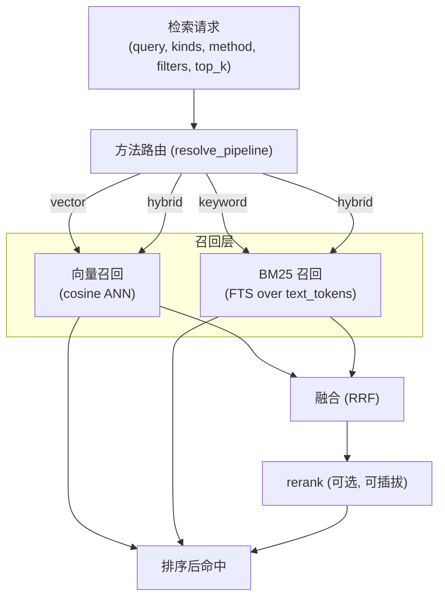

# 统一检索层

检索层是记忆模块的"取数引擎"。三类记忆共用同一套检索层——这是模块内的复用,不是跨模块耦合:检索层只认 `kind` + 过滤条件 + 检索方法,不关心记忆的业务语义。

设计目标:**对调用方暴露尽量少的"检索方法",把向量/BM25/融合/rerank 的复杂度全部收进内部。** 直接对应解耦原则——调用方不应被迫理解 RRF 是什么。

> **本文的抽象接口都在记忆模块内**(`modules/memory/contracts/`),不在底座。原因见 [模块 README](./README.md):它们目前只服务记忆模块,按"避免过度设计"不预先上提。

## 检索能力总览



对外只有三个 `method`:

| method | 含义 | 内部走的路 |
|--------|------|-----------|
| `vector` | 纯语义检索 | 向量召回,直接返回 |
| `keyword` | 纯关键词检索 | BM25 召回,直接返回 |
| `hybrid`(默认) | 语义 + 关键词融合 | 双路召回 → RRF 融合 → 可选 rerank |

> **借鉴 EverOS 的"方法→管线路由"**:对外暴露稳定的少数方法枚举,内部用一张路由表把 (method, kind) 映射到具体管线。新增内部融合策略不改对外接口。本阶段路由简单(三选一),但结构上预留"按 kind 走不同管线"的扩展位——未来 experience 可走更复杂融合、personal 走标准 RRF,对外仍是 `hybrid`。

## 召回层

### 向量召回

- 用 `EmbeddingProvider.embed(query)` 得 query 向量,在 LanceDB `vector` 列做 cosine ANN【已验证】。
- 应用 `where` 过滤(owner_id、namespace、kind、deprecated=False)作为 **prefilter**(检索前缩小工作集,走标量过滤【已验证】)。

### BM25 召回

- 对 query 走同样的分词(`Tokenizer` 抽象)得 query tokens,在 `text_tokens` 列做 FTS/BM25【已验证:LanceDB 原生 BM25 FTS】。
- **OR-mode 查询**(借鉴 EverOS):把 query 多个 token 以 "SHOULD" 方式组合,而非隐式 AND。**为什么?** 避免单个 IDF≈0 高频 token(如用户名)把整个 AND 查询拖成零命中。这是 EverOS 踩过的坑,直接采纳。
  - 注意:LanceDB Lance-native FTS **不支持查询串里的布尔操作符** OR/AND【已验证:LanceDB docs 限制】。OR 语义需通过 API 层面查询构造实现(或对每个 token 分别查询后合并),**【待验证:以 LanceDB 当前版本 FTS query API 为准,落地需确认 OR 组合实现方式】**。

> **标注**:OR-mode 的*意图*来自 EverOS(基于 tantivy 的 `BooleanQuery` + `Occur.SHOULD`)。Kairos 用 LanceDB,其 FTS 已从 Tantivy 转 Lance-native,query 构造 API 不同,**具体实现方式待验证**:意图明确、手段待定。

## 混合融合:RRF

本阶段融合策略选 **RRF(Reciprocal Rank Fusion,倒数排名融合)**。

```python
# modules/memory/retrieval/fusion.py(草案,纯计算,同步)
def reciprocal_rank_fusion(
    runs: list[list[str]],        # 多路召回,每路是按相关度排序的 id 列表
    k: int = 60,                  # RRF 常数,缓和高排名统治力
    weights: list[float] | None = None,
) -> list[tuple[str, float]]:
    """对每个 id 累加 w/(k + rank),跨路求和后降序。"""
    weights = weights or [1.0] * len(runs)
    scores: dict[str, float] = {}
    for run, w in zip(runs, weights):
        for rank, doc_id in enumerate(run):
            scores[doc_id] = scores.get(doc_id, 0.0) + w / (k + rank)
    return sorted(scores.items(), key=lambda x: -x[1])
```

**为什么选 RRF 而非加权分数融合?**

| | RRF(选定) | 加权分数融合(备选) |
|---|---|---|
| 输入 | 只需各路**排名** | 需各路**原始分数** |
| 跨路可比 | 天然可比(都是排名) | cosine 与 BM25 量纲不同,需归一化,难调 |
| 调参 | 一个 `k`,鲁棒 | 权重 + 归一化方式,敏感 |
| LanceDB | **原生默认就是 RRF**【已验证】 | 需自己实现 |

RRF 不需把量纲不同的 cosine 和 BM25 强行归一化,只看排名,简单鲁棒,且是 LanceDB hybrid 的**默认融合器**【已验证:默认 `RRFReranker()`】,与库默认行为一致。加权融合作**备选**保留在 `weights` 参数;更复杂的 LR 校准融合(EverOS 做法)列为扩展,见 [tradeoffs](./tradeoffs.md)。

> **实现选择**:倾向**应用层自己做双路召回 + RRF**,而非依赖 LanceDB 内置 hybrid API——这样融合逻辑可读、可测、可换,不被库 API 形态绑死(符合"算法在仓库内、透明可改"的取舍)。LanceDB 内置 RRF 作 fallback/对照。

## Rerank(可选,可插拔)

融合后的**精排**:用更强(更慢)的模型对融合后 top-N 重新打分排序。

- **默认关闭**(`rerank.enabled=False`)。开启后对 RRF 后 top-N(如 30)调 `RerankProvider.rerank(query, texts)`,按返回分数重排取 top_k。
- 只在 `hybrid` 方法下、显式开启时生效。

**Rerank 契约:只排序,不过滤**(借鉴 EverOS):

```python
# modules/memory/contracts/rerank.py(草案)
from typing import Protocol, Sequence, runtime_checkable
from dataclasses import dataclass

@dataclass
class RerankResult:
    index: int     # 在输入 documents 列表中的原始下标
    score: float   # provider 定义,越高越相关

@runtime_checkable
class RerankProvider(Protocol):
    async def rerank(
        self, query: str, documents: Sequence[str], *,
        instruction: str | None = None,   # 支持 instruction-tuned reranker
    ) -> list[RerankResult]:
        """返回每个输入文档一条,按 score 降序。
        约定:provider 不做过滤/截断 —— top_k 截断由调用方负责。
        保证跨 provider 契约稳定,调用方逻辑不随 provider 变。"""
        ...
```

> **为什么"只排序不过滤"?** 若让 provider 自己决定返回几条,换 provider 就可能改变结果数量,调用方分页/截断逻辑全乱。约定返回全量 `(index, score)`、过滤交调用方,保证跨 provider 行为一致——EverOS 的干净约定,直接采纳。

## 可插拔模型抽象接口

"模块与模型解耦"的核心实现。四个抽象 + 一个工厂,**都在记忆模块内**。

### EmbeddingProvider

```python
# modules/memory/contracts/embedding.py(草案)
from typing import Protocol, Sequence, runtime_checkable

@runtime_checkable
class EmbeddingProvider(Protocol):
    dim: int   # 向量维度,必须与 LanceDB 向量列一致

    async def embed(self, text: str) -> list[float]: ...

    async def embed_batch(self, texts: Sequence[str]) -> list[list[float]]:
        """批量,内部分块 + 并发限流(Semaphore)。写入大批记忆走这条。"""
        ...
```

本阶段两个实现(`providers/embedding/`):

- `openai_compat`:任何 OpenAI 兼容协议端点。**关键洞察**(借鉴 EverOS):OpenAI / DeepInfra / vLLM / Ollama / Together 都讲 OpenAI 协议,一个实现 + 不同 `base_url` 就覆盖"远程 API"和"本地自托管"两类,无需为每家分叉。
- `sentence_transformer`:纯本地、进程内 ST 模型,无网络依赖。

### RerankProvider

见上文。本阶段实现 `cross_encoder`(本地)与 `http_rerank`(远程)。

### Tokenizer

```python
# modules/memory/contracts/tokenizer.py(草案,注意同步)
from typing import Protocol, Sequence, runtime_checkable

@runtime_checkable
class Tokenizer(Protocol):
    def tokenize(self, text: str) -> list[str]: ...
    def tokenize_batch(self, texts: Sequence[str]) -> list[list[str]]: ...
```

- **同步**:纯 CPU 计算,无 IO,不需 async(与 EverOS 一致)。
- 默认实现:中文 jieba + 停用词过滤。结果存进 `text_tokens` 列。
- **为什么抽象成接口?** 中文/多语言分词策略会演进,抽象后换分词器只需换实现 + 重算 `text_tokens` 列,不动 schema、不动检索逻辑。

### VectorStore

```python
# modules/memory/contracts/vector_store.py(草案,节选)
from typing import Protocol, Sequence, Any, runtime_checkable

@runtime_checkable
class VectorStore(Protocol):
    async def upsert(self, table: str, rows: Sequence[dict[str, Any]]) -> int: ...
    async def vector_search(self, table: str, query_vector: list[float], *,
                            where: str | None = None, limit: int = 20) -> list[dict[str, Any]]: ...
    async def fts_search(self, table: str, query_tokens: list[str], *,
                         where: str | None = None, limit: int = 20) -> list[dict[str, Any]]: ...
    async def delete(self, table: str, where: str) -> int: ...
    async def optimize(self, table: str) -> None: ...   # 索引维护(见 memory-types)
```

唯一实现:`providers/vector/lancedb_store.py`。**记忆领域逻辑只见这个抽象,见不到 `lancedb`。** 换向量库 = 写新实现 + 跑过契约测试(见 [foundation](../../foundation/foundation.md))。

### Factory:配置驱动组装

```python
# modules/memory/providers/factory.py(草案)
def build_embedding_provider(cfg: EmbeddingConfig) -> EmbeddingProvider:
    match cfg.impl:
        case "openai_compat":        return OpenAICompatEmbedding(cfg)
        case "sentence_transformer": return SentenceTransformerEmbedding(cfg)
        case _: raise ConfigError(f"unknown embedding impl: {cfg.impl}")

def build_rerank_provider(cfg: RerankConfig) -> RerankProvider:
    # 可由 base_url host 自动推断 provider(借鉴 EverOS),此处简化为显式 impl
    ...
```

> **新增一个 provider 的全部工作量**:写一个实现文件 + 工厂加一个 `case`。这是"可插拔"在代码层面的兑现——改动局限在模块的 `providers/` 内,领域逻辑零改动。

## 检索编排接口

把上面拼起来,检索层对记忆 facade 暴露的入口:

```python
# modules/memory/retrieval/searcher.py(草案)
class Searcher:
    def __init__(self, store: VectorStore, embedder: EmbeddingProvider,
                 tokenizer: Tokenizer, reranker: RerankProvider | None): ...

    async def search(self, *, table: str, query: str, method: str = "hybrid",
                     where: str | None = None, top_k: int = 10,
                     use_rerank: bool = False) -> list[Hit]:
        """统一检索入口。按 method 路由,内部完成召回/融合/rerank。
        - use_rerank=True 但 reranker is None → 抛 NotConfiguredError(fail-fast)
        """
        ...
```

`Hit` 是检索层内部结果对象(id + score + 原始行),由 facade 转成领域结果,最终由适配层转 DTO(见 [api](./api.md))。

---

下一篇:[api](./api.md) — 记忆模块对外接口。
