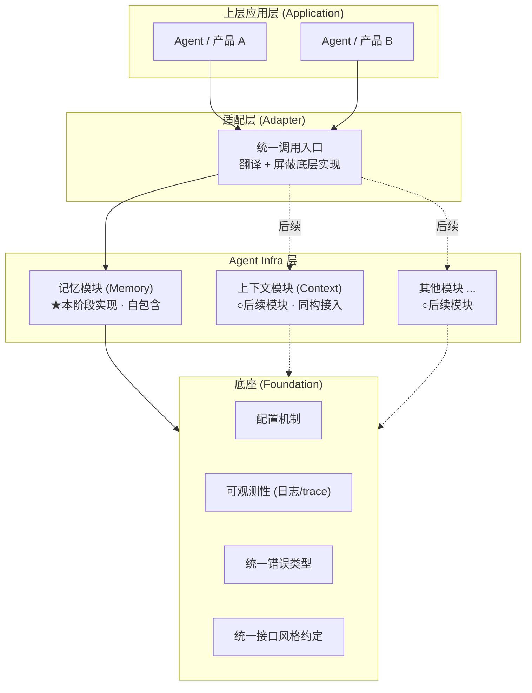
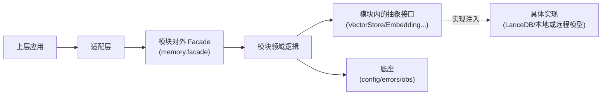
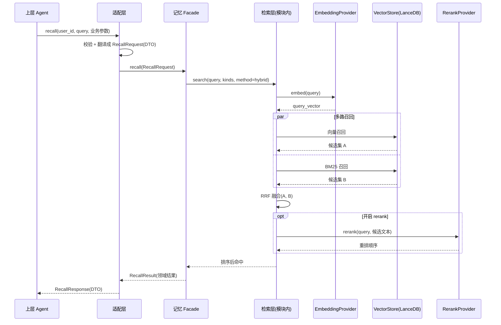

# 整体架构

## 三层架构与职责边界

Kairos 采用三层架构,每层职责单一、边界清晰:

| 层 | 职责 | 不该做的事 |
|----|------|-----------|
| **上层应用层** | 具体 Agent / 产品的业务逻辑、编排、与 LLM 对话。决定"写什么记忆、何时检索"。 | 不直接依赖 infra 内部数据结构、不直接 import 模块的领域模型。 |
| **适配层** | 把上层业务语言翻译成 infra 接口;参数校验、鉴权占位、协议转换。是上层与 infra 之间**唯一的耦合点**。 | 不写模块领域逻辑;不绕过模块直接访问其存储。 |
| **Agent Infra 层** | 各 infra 模块的领域逻辑与存储。每个模块**自包含**:自己的领域逻辑、存储/模型抽象、对外 facade。本阶段只实现记忆模块。 | 模块之间不互相 import 内部实现。 |
| **底座 (Foundation)** | 横切关注点:配置、可观测性、错误类型、接口风格约定。所有模块共享。 | 不含任何业务/记忆逻辑,保持"薄"。具体见 [foundation](../foundation/foundation.md)。 |

## 模块依赖方向

**依赖只能从上往下、从外到内,绝不反向。**

三条硬规则:

1. **应用 → 适配 → infra 模块 → 底座**,单向。底座不依赖任何模块。
2. **领域逻辑依赖抽象,不依赖实现**。记忆领域逻辑依赖模块内的 `VectorStore`/`EmbeddingProvider` 抽象;LanceDB、OpenAI 等实现由配置在启动时注入(依赖倒置)。
3. **模块之间不横向依赖内部**。记忆模块与未来的上下文模块,只能通过各自的 facade 或底座契约通信。

> **注意抽象接口的归属**:`VectorStore`/`EmbeddingProvider` 等抽象目前在**记忆模块内部**(`memory/contracts/`),不在底座。原因见 [overview](./overview.md) 的"避免过度设计"原则——它们只有记忆模块用。这不影响依赖倒置:模块的领域逻辑依赖模块内的抽象,具体实现配置注入,可插拔性照样成立。

> **为什么强调依赖方向?** 这是"可插拔"能否成立的技术基础。只要领域逻辑里出现一处 `import lancedb`,LanceDB 就再也换不掉了。把依赖方向做成可被 lint 检查的硬规则(见 [foundation](../foundation/foundation.md) 的 import-linter),解耦才不会随时间腐化。

## 解耦如何落地(从原则到机制)

每条原则都对应一个具体机制,不是口号:

| 解耦原则 | 落地机制 | 在哪 |
|----------|---------|------|
| 上层与 infra 解耦 | 适配层作唯一翻译边界;对外只暴露 DTO,不暴露领域模型 | [memory/api](../modules/memory/api.md) |
| 模块与向量库解耦 | 模块内 `VectorStore` 抽象 + LanceDB 实现 | [memory/retrieval](../modules/memory/retrieval.md) |
| 模块与模型解耦 | 模块内 `EmbeddingProvider`/`RerankProvider` Protocol + Factory | [memory/retrieval](../modules/memory/retrieval.md) |
| 模块之间解耦 | 每个模块有独立 facade;模块自包含,互不 import 内部 | [memory/README](../modules/memory/README.md) |
| 检索复杂度对调用方解耦 | "方法→管线路由":对外暴露 vector/keyword/hybrid,内部融合隐藏 | [memory/retrieval](../modules/memory/retrieval.md) |
| 实现可替换性可验证 | 针对抽象接口写契约测试,任何实现必须通过 | [foundation](../foundation/foundation.md) |

## 一次典型调用的数据流

以"Agent 在对话中检索相关记忆"为例:

解耦点在链路上的体现:App 传业务参数、适配层翻译成 DTO;检索层调的是抽象接口,注入本地模型+本地 LanceDB 或远程 API,链路代码不变;融合与是否 rerank 在检索层内部决定,调用方只说了 `method=hybrid`。

## 部署形态(本阶段)

本阶段默认**单机嵌入式**:infra 作为 Python 库被适配层进程内调用,LanceDB 以本地文件目录存储。与 [overview](./overview.md) 的"不做分布式"非目标一致。

未来若需服务化(HTTP/gRPC),适配层是天然的服务化边界——把适配层包成服务进程,对外 API 签名(见 [memory/api](../modules/memory/api.md))不变。本阶段不实现,见 [roadmap](./roadmap.md)。

---

下一篇:[roadmap](./roadmap.md) — 交付总览、新模块接入流程、演进路线。
