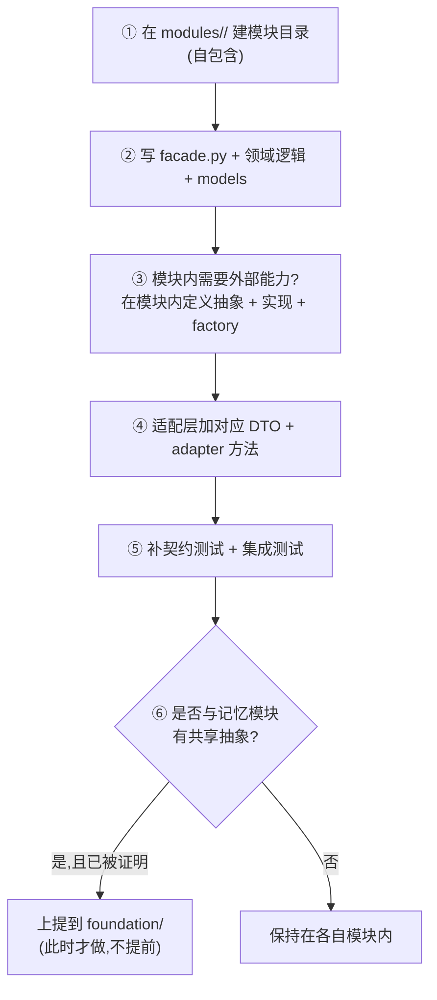
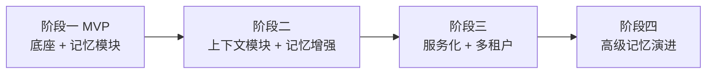

# 演进路线与交付

本文是**项目层**的演进视角:跨模块的交付总览、新模块如何接入、整体路线图、项目级风险。模块内部的交付细节与风险见各模块文档(如 [memory/tradeoffs](../modules/memory/tradeoffs.md))。

## 第一阶段交付总览

第一阶段范围 = **底座 + 记忆模块 + benchmark 子项目**。

> **benchmark 是一等子项目,不是附属测试**(经研讨确定)。它衡量"高精确率、低噪音"这个目标,是记忆模块所有设计取舍的裁判。推进策略:**先评测协议 + harness 框架 + 小规模中文种子集打通端到端,记忆模块边实现边用它验证,数据规模后迭代扩充**。详见 [benchmark](../modules/benchmark/README.md)。

### 底座(详见 [foundation](../foundation/foundation.md))

- [ ] 项目目录骨架(`foundation/` + `modules/memory/`)
- [ ] 配置机制(`KairosSettings`,实现选择走配置,密钥走环境变量)
- [ ] 统一错误层级(`errors.py`)
- [ ] 结构化日志 + trace 接入点(no-op 默认)
- [ ] 统一接口风格约定(同步/异步、错误处理)成文
- [ ] import-linter 依赖方向规则 + CI
- [ ] 测试骨架(unit/contracts/integration)

### 记忆模块(详见 [modules/memory](../modules/memory/README.md))

- [ ] 模块内抽象:`VectorStore`/`EmbeddingProvider`/`RerankProvider`/`Tokenizer` + 契约测试
- [ ] 实现:LanceDB store;openai_compat + sentence_transformer embedding;cross_encoder + http_rerank;jieba tokenizer;配置驱动 factory
- [ ] 共享 `MemoryBase` schema + 三类 kind schema
- [ ] 统一写入管线(校验→去重→分词→embed→hash→upsert)
- [ ] 三类记忆的写入/检索/淘汰:personal、session、experience
- [ ] 执行经验:trace schema + distiller(规则门控+LLM 抽取)+ reinforce 回调 + 衰减/容量淘汰
- [ ] 检索层:向量/BM25 召回 + RRF 融合 + 可选 rerank + 方法路由
- [ ] 后台维护任务(optimize + TTL 清理 + 衰减)
- [ ] 适配层:DTO + MemoryAdapter + 错误翻译
- [ ] 验证 spike:LanceDB FTS OR-mode 实现确认

### Benchmark 子项目(详见 [modules/benchmark](../modules/benchmark/README.md))

- [ ] 评测协议成文(能力分类、Precision@K/abstention/distractor、写入/检索分离、LLM-judge 防坑)
- [ ] 场景本体 + 用户属性本体(需业务输入)
- [ ] harness 框架代码(喂入记忆 → 检索 → 收集 → 打分,通过记忆模块对外接口)
- [ ] 小规模中文种子集(几十题,覆盖 IE/MR/KU/TR/ABS 五类)
- [ ] 记忆模块边实现边用 benchmark 验证(回灌设计取舍:去重阈值、融合权重、是否 rerank、衰减系数)
- [ ] 数据集迭代扩充

### 文档(本资产)

- [x] 项目层文档(`project/`)
- [x] 底座文档(`foundation/`)
- [x] 记忆模块文档(`modules/memory/`)
- [x] benchmark 子项目文档(`modules/benchmark/`)
- [x] ADR(0001-0005)

## 新模块如何接入(通用流程)

这是底座设计要保证的核心能力。任何后续 infra 模块(上下文等)都按同一套流程接入,**不动已有模块和底座核心**:

代码层面的规则(由 import-linter 强制):

1. 模块在 `src/kairos/modules/<name>/`,只依赖 `foundation/` 和自己。
2. **不**依赖其他业务模块内部、**不**让具体实现(如 `lancedb`)泄漏到领域逻辑。
3. 需新的外部能力,在**模块内**加抽象 + 实现 + factory。
4. 适配层加 DTO + adapter 方法。

> **第⑥步是"避免过度设计"的关键决策点。** 只有当上下文模块真的需要、且与记忆模块的抽象**确实重合**时,才把共享抽象上提到底座。在那之前,即使两个模块各有一个 `EmbeddingProvider`,也宁可暂时"重复"也不预先抽象——预先抽象的接口几乎总是猜错。共享是被发现的,不是被预测的。

## 演进路线

### 阶段二:上下文模块 + 记忆增强

- **接入上下文模块**(`modules/context/`),按上面的通用流程。**这是验证底座可插拔性的第一个真实案例**:如果接入时需要改动记忆模块或底座核心,说明底座抽象有漏,要回补。
- 此时评估:记忆和上下文是否共享 embedding/向量库抽象?若是,上提到底座(承接阶段一刻意留下的"暂不上提"决策)。
- **记忆增强**:自动抽取个人记忆、更精细的融合策略、experience 自动分段。

### 阶段三:服务化 + 多租户

- 适配层包成 HTTP/gRPC 服务(DTO 已 Pydantic 化,路径已铺好,见 [memory/api](../modules/memory/api.md))。
- 启用 `owner_id`/`namespace` 的完整多租户隔离、鉴权、配额。
- 评估 LanceDB 多节点/对象存储部署,或按需切换向量库实现(契约测试保障可替换)。

### 阶段四:高级记忆演进

- 记忆合并/反思循环、冲突消解、遗忘曲线。
- 图记忆 / 知识图谱(若需求出现)。
- 经验的复杂信用分配与强化。

## 项目级风险与开放问题

模块内的具体技术风险见 [memory/tradeoffs](../modules/memory/tradeoffs.md)。这里只列**跨模块/项目层**的:

| 风险 / 问题 | 等级 | 说明 | 缓解 |
|------|------|------|------|
| **底座抽象不足或过度** | 中 | 底座抽象漏了 → 接第二个模块时要改记忆模块;抽象过度 → 违背 YAGNI、增加无谓复杂度 | 阶段二接入上下文模块作为试金石;现在保持底座薄 |
| **共享抽象上提时机** | 中 | 过早上提是过度设计,过晚上提则两模块重复劳动 | 以"第二个模块确有复用需求"为触发条件,不提前 |
| **依赖方向腐化** | 中 | 随代码增长,可能出现违规 import(模块横向依赖、实现泄漏) | import-linter 在 CI 强制依赖规则 |
| **单机容量上限** | 低 | 本阶段单机,数据量/QPS 上限未压测 | 符合 MVP Non-goal;阶段二容量评估 |

### 判断底座是否成功的终极标准

阶段二接入上下文模块时,上面的"通用接入流程"能否走通而**不改动记忆模块和底座核心**。如果能,"高内聚低耦合、可插拔"就从设计文档变成了被验证的事实。

---

← 返回 [文档导航](../README.md)
